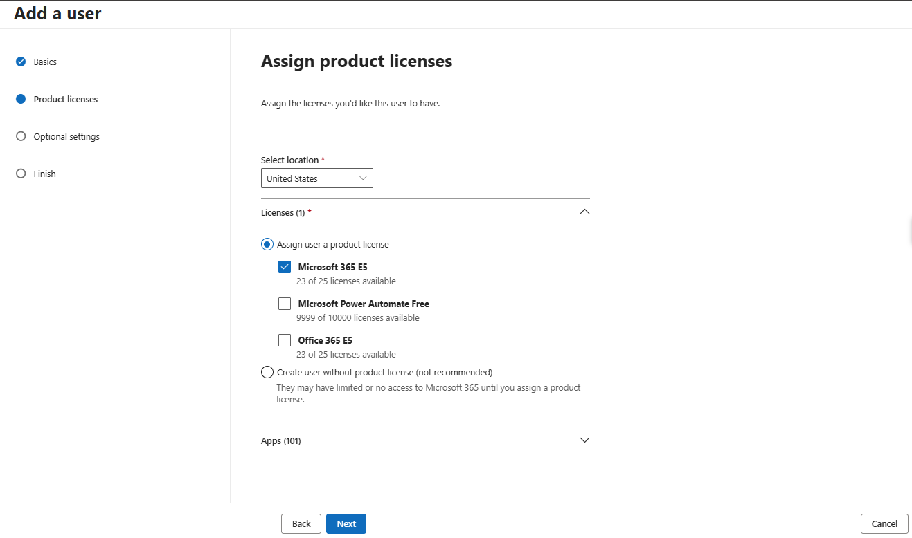
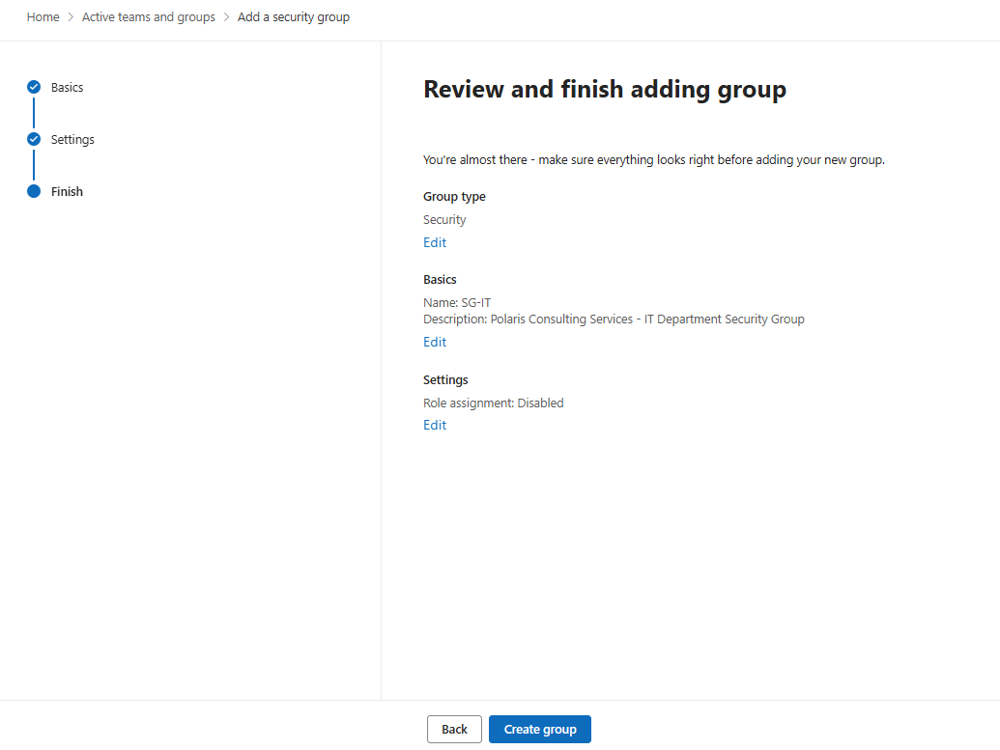
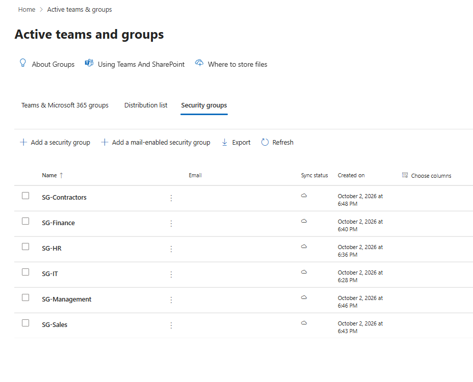
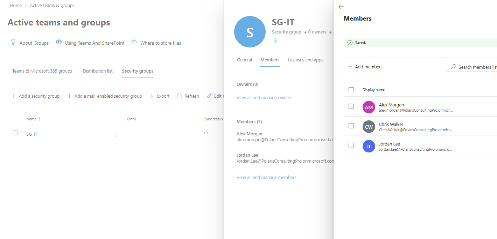
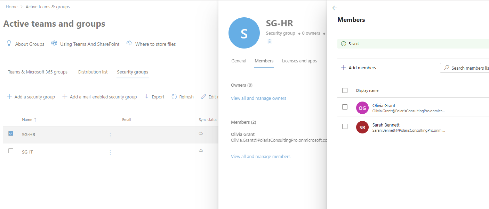
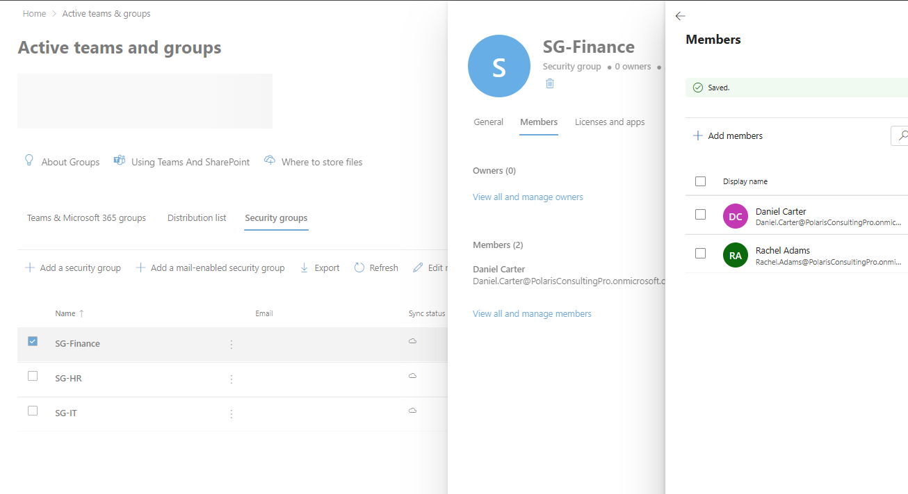
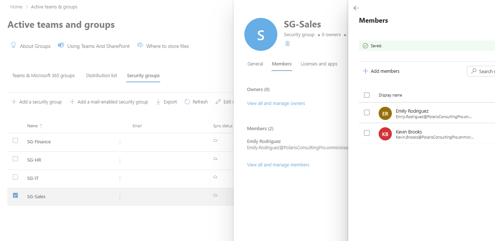
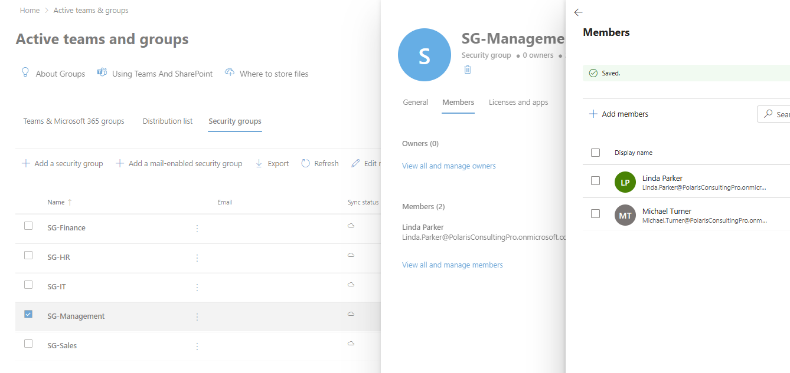
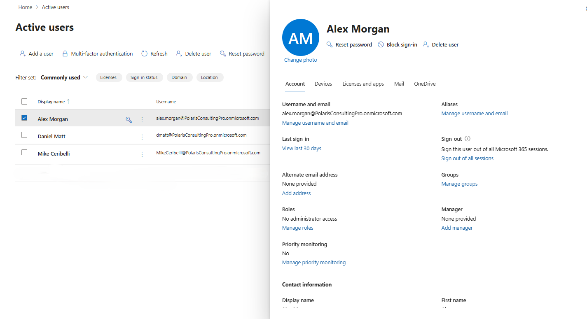

# Lab 01 — Tenant Foundation

**Status:** Complete

## Overview

Establishes the Microsoft 365 tenant baseline used throughout the portfolio: identities, licensing, department security groups, and a clear separation between standard users and administrative access.

## Scenario

Polaris Consulting Services required a reusable tenant structure that could support help desk, Microsoft 365 administration, endpoint management, security, compliance, and reporting exercises without rebuilding the environment for each project.

## Objectives

- Create representative user accounts across IT, HR, Finance, Sales, Management, and contractor functions.
- Assign Microsoft 365 and Office 365 licenses deliberately.
- Create department security groups with assigned membership.
- Verify that standard users begin without unnecessary administrative roles.
- Capture a clean baseline before role delegation and service-specific configuration.

## Tools and Services Used

- Microsoft 365 admin center
- Microsoft Entra admin center
- Microsoft Entra ID
- Microsoft 365 E5 / Office 365 E5

## Administrative Workflow

The portal procedures below reflect the navigation used during this lab. Microsoft occasionally changes portal labels or menu placement, but the administrative sequence and validation points remain the same.

### Step 1 — Review licensing and user assignment

Licensing was reviewed before the lab accounts were used so that service access could be tied to the intended role rather than assigned indiscriminately.

<strong>Portal procedure</strong>

**Navigation:** Microsoft 365 admin center → Billing → Licenses / Users → Active users

1. Open the Microsoft 365 admin center.
2. Review the available Microsoft 365 E5 and Office 365 E5 subscriptions under **Billing → Licenses**.
3. Go to **Users → Active users**.
4. Open each lab user that requires a service license.
5. Select **Licenses and apps**.
6. Set the usage location when required, then assign the intended Microsoft 365 or Office 365 license.
7. Save the change and verify that the license appears on the user's account.

### Step 2 — Create and review department security groups

Assigned-membership security groups were created for the main business departments. The group model was kept simple so later policy assignments could be scoped predictably.

<strong>Portal procedure</strong>

**Navigation:** Microsoft Entra admin center → Identity → Groups → All groups → New group

1. Open the Microsoft Entra admin center.
2. Go to **Identity → Groups → All groups**.
3. Select **New group**.
4. Set **Group type** to **Security**.
5. Enter the department group name, such as `SG-IT`, `SG-HR`, or `SG-Sales`.
6. Set **Membership type** to **Assigned**.
7. Leave Microsoft Entra roles assignable to the group disabled unless the group is specifically intended for privileged role assignment.
8. Create the group and repeat for the remaining departments.
9. Return to **All groups** and review the completed group list.

### Step 3 — Validate group membership

Membership was checked across the department groups to confirm that the organizational structure matched the planned user personas.

<strong>Portal procedure</strong>

**Navigation:** Microsoft Entra admin center → Identity → Groups → All groups → <group> → Members

1. Open the department security group.
2. Select **Members**.
3. Confirm that only the intended users are listed.
4. Use **Add members** if a planned user is missing.
5. Remove any user who does not belong to the department.
6. Repeat the review for each department group.

### Step 4 — Confirm the standard-user baseline

A standard user profile was reviewed to confirm that ordinary lab identities did not begin with administrative privileges.

<strong>Portal procedure</strong>

**Navigation:** Microsoft Entra admin center → Identity → Users → All users → <user> → Assigned roles

1. Open **Identity → Users → All users**.
2. Select a standard lab user such as Alex Morgan.
3. Review the user profile and account state.
4. Open **Assigned roles**.
5. Confirm that no administrative directory role is assigned.
6. Use the result as the baseline before any delegated-administration labs begin.

## Expected Outcome

A reusable tenant baseline with licensed users, predictable department groups, and no unnecessary privilege assigned to normal user accounts.

## Validation

- 12 lab users were created and organized by business function.
- Department security groups used assigned/static membership.
- Licensing was distributed deliberately across the lab accounts.
- Standard user accounts were confirmed without administrative roles.

## Security Considerations

- Administrative privilege was not granted during user creation.
- Group design was kept explicit and static to make later policy targeting easy to audit.
- No Azure consumption-based resources were required for the tenant foundation.

## Key Takeaways

- A consistent identity and group model makes later Microsoft 365 administration easier to validate and troubleshoot.
- License assignment, group membership, and administrative privilege are separate controls and should be reviewed independently.
- A documented baseline provides a reference point for later role, policy, and endpoint changes.
