# Lab 04 — Exchange Online Administration

**Status:** Complete

## Overview

Covers shared mailbox administration, delegated permissions, distribution groups, aliases, message trace, and a real mail-flow troubleshooting sequence.

## Scenario

The Sales and support teams required shared messaging resources and an alternate email alias. During validation, the first alias test failed, creating a useful mail-flow troubleshooting case.

## Objectives

- Create a shared support mailbox.
- Delegate Full Access and Send As permissions.
- Create and validate a Sales distribution group.
- Configure an alternate alias for a Sales user.
- Investigate a failed alias-delivery attempt.
- Use Message Trace and Defender evidence to confirm the final delivery state.

## Tools and Services Used

- Exchange admin center
- Exchange Online
- Microsoft Defender portal
- Message Trace
- Outlook / Outlook on the web

## Administrative Workflow

The portal procedures below reflect the navigation used during this lab. Microsoft occasionally changes portal labels or menu placement, but the administrative sequence and validation points remain the same.

### Step 1 — Create the shared support mailbox

A shared mailbox named `Polaris Support` was created as the central support address.

<strong>Portal procedure</strong>

**Navigation:** Exchange admin center → Recipients → Mailboxes → Add a shared mailbox

1. Open the Exchange admin center.
2. Go to **Recipients → Mailboxes**.
3. Select **Add a shared mailbox**.
4. Enter the display name `Polaris Support`.
5. Enter the support address for the Polaris tenant.
6. Create the mailbox.
7. Re-open the mailbox and verify that it appears as a shared mailbox.

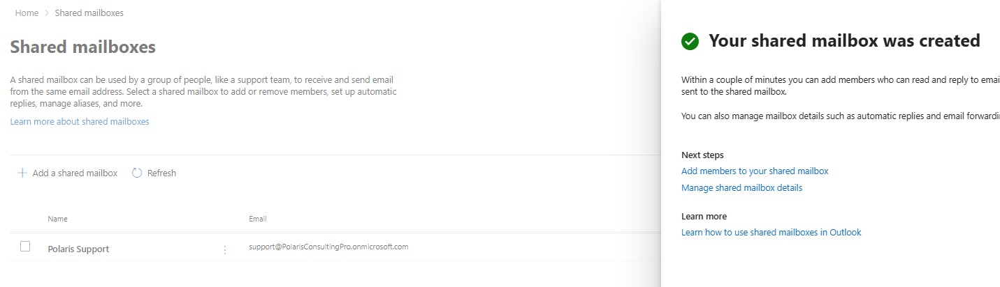

### Step 2 — Configure mailbox delegation

Full Access and Send As permissions were assigned to Jordan Lee and Chris Walker. The mailbox configuration was reviewed after creation.

<strong>Portal procedure</strong>

**Navigation:** Exchange admin center → Recipients → Mailboxes → Polaris Support → Delegation

1. Open the `Polaris Support` shared mailbox.
2. Open **Delegation** or the permissions section.
3. Under **Read and manage (Full Access)**, add Jordan Lee and Chris Walker.
4. Under **Send As**, add Jordan Lee and Chris Walker.
5. Save the permission changes.
6. Re-open the delegation view and confirm both permission sets.

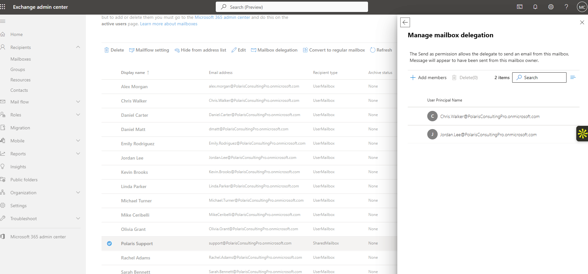

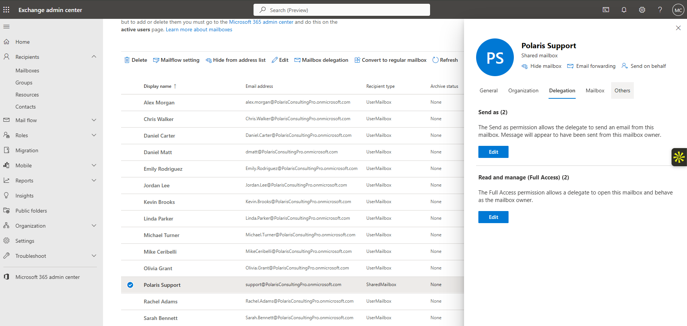

### Step 3 — Validate delegated sending and automatic reply behavior

The shared mailbox was used to validate Send As functionality and the configured automatic-reply behavior.

<strong>Portal procedure</strong>

**Navigation:** Outlook on the web / Exchange admin center → Shared mailbox access + automatic replies

1. Sign in as a delegated user.
2. Open the shared mailbox or use **Open another mailbox**.
3. Compose a message and set the sender to `Polaris Support`.
4. Send the test and confirm that the recipient sees the shared mailbox as the sender.
5. Open the shared mailbox settings in Exchange if automatic replies are configured.
6. Send a separate test message to the support address and confirm the automatic reply is received.

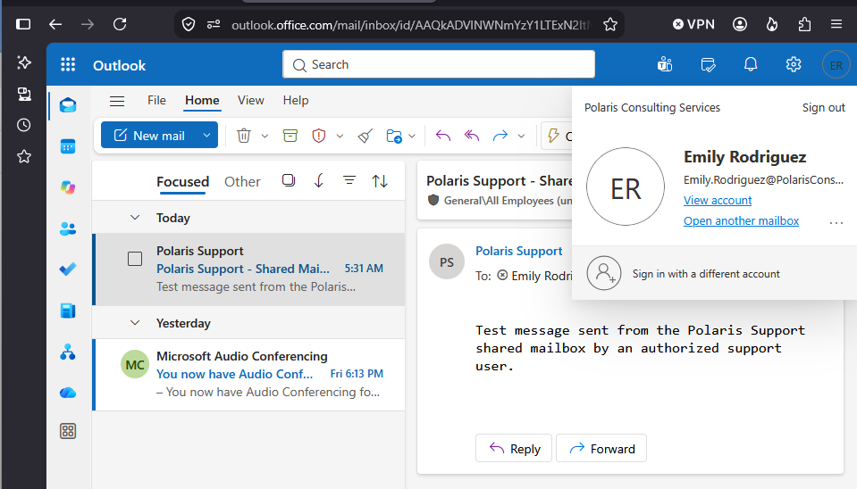

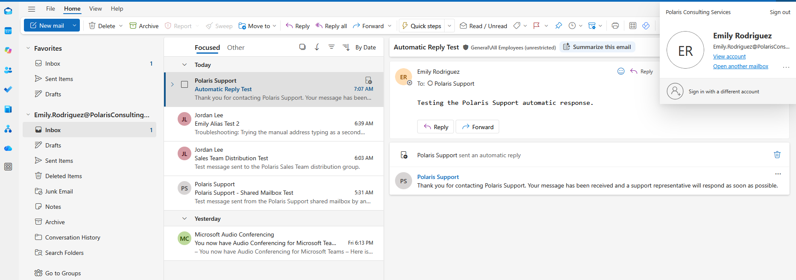

### Step 4 — Create the Sales distribution group

The `Sales Team` distribution group was created with Jordan Lee as owner and Emily Rodriguez and Kevin Brooks as members.

<strong>Portal procedure</strong>

**Navigation:** Exchange admin center → Recipients → Groups → Distribution list → Add group

1. Open **Recipients → Groups**.
2. Create a new **Distribution list**.
3. Name the group `Sales Team` and assign the group email address.
4. Set Jordan Lee as the owner.
5. Add Emily Rodriguez and Kevin Brooks as members.
6. Create the group.
7. Re-open the group and verify the owner, members, and address.

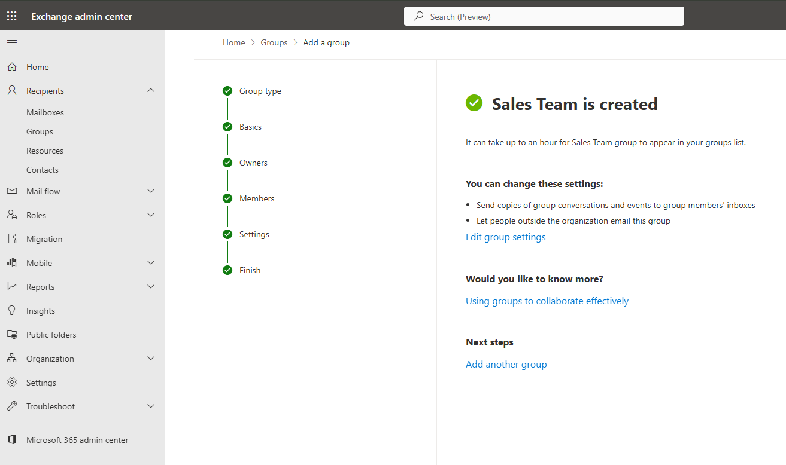

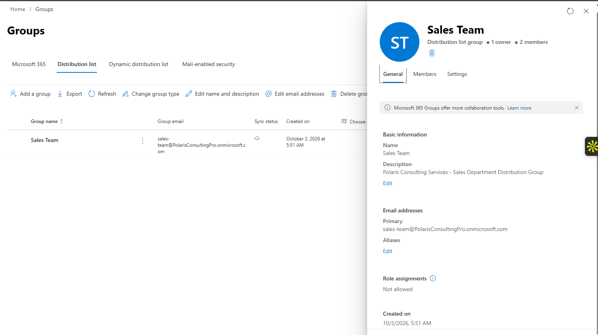

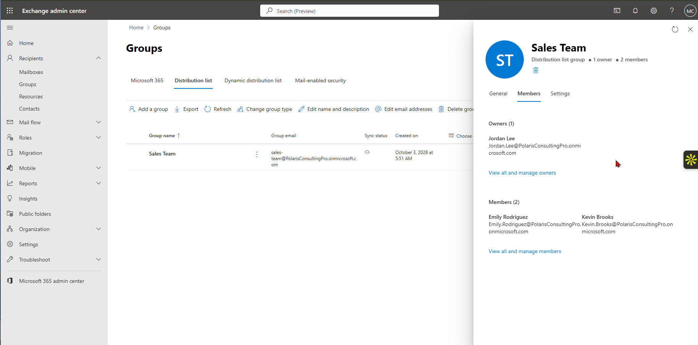

### Step 5 — Configure the user alias

The alternate address `e.rodriguez@PolarisConsultingPro.onmicrosoft.com` was added to Emily Rodriguez.

<strong>Portal procedure</strong>

**Navigation:** Exchange admin center → Recipients → Mailboxes → Emily Rodriguez → Email addresses

1. Open **Recipients → Mailboxes**.
2. Select Emily Rodriguez.
3. Open **Email addresses**.
4. Add the alias `e.rodriguez@PolarisConsultingPro.onmicrosoft.com`.
5. Save the mailbox changes.
6. Re-open the address list and confirm the alias is present.

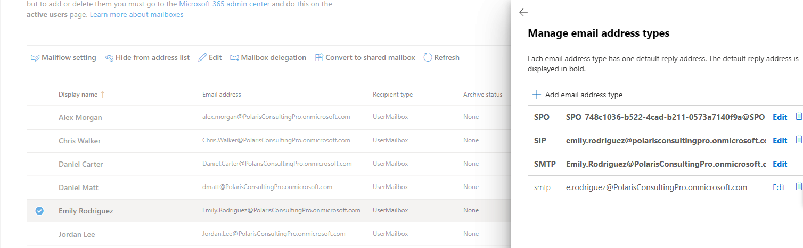

### Step 6 — Investigate the first failed alias test

The first message to the alias returned a recipient-not-found failure. The Exchange configuration was rechecked before changing anything.

<strong>Portal procedure</strong>

**Navigation:** Outlook on the web / Exchange admin center → Send test → verify alias configuration

1. Send a test message to the new alias.
2. Record the delivery failure and the `550 5.1.10 RecipientNotFound` result.
3. Return to Emily Rodriguez's mailbox in Exchange admin center.
4. Re-check the email-address list and confirm that the alias is correctly configured.
5. Avoid changing mail-flow or security policy until the client-side recipient information has also been checked.

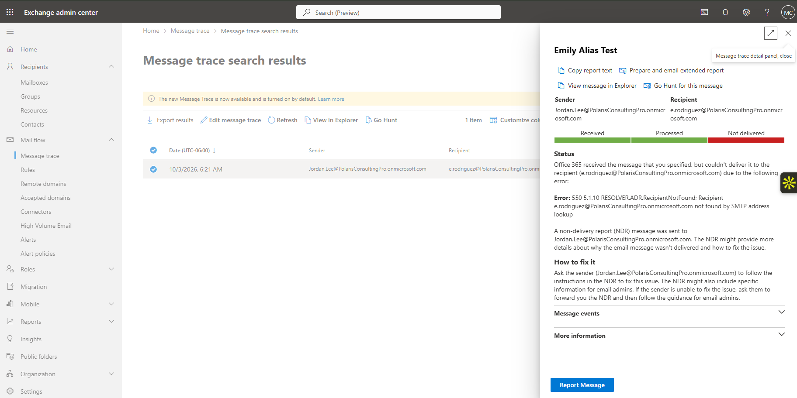

### Step 7 — Clear the stale recipient entry and retest

The Outlook AutoComplete entry was cleared and the address was entered again manually. The retest delivered successfully.

<strong>Portal procedure</strong>

**Navigation:** Outlook / Outlook on the web → Recipient AutoComplete → re-enter alias → send

1. Start a new message.
2. Remove the cached AutoComplete recipient associated with the failed alias attempt.
3. Type the alias manually rather than selecting the stale cached entry.
4. Send a new test message.
5. Verify that the message is delivered to Emily's mailbox.

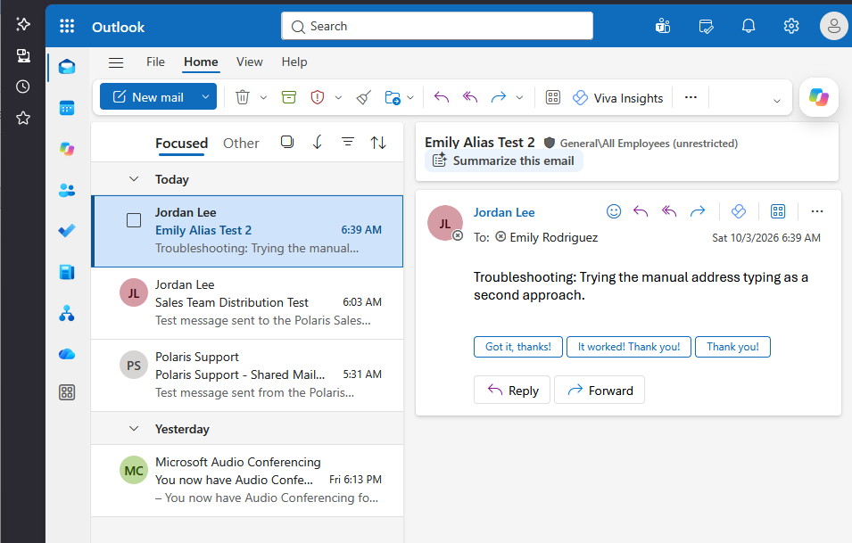

### Step 8 — Correlate the result with Message Trace

Message Trace was used to compare the failed and successful attempts and provide authoritative delivery evidence.

<strong>Portal procedure</strong>

**Navigation:** Exchange admin center → Mail flow → Message trace

1. Open **Mail flow → Message trace**.
2. Set an appropriate time range that includes both alias tests.
3. Filter by the sender and/or Emily's alias.
4. Run the trace.
5. Open the failed result and review its delivery status.
6. Open the successful result and confirm delivery.
7. Use the two records together to document the troubleshooting sequence.

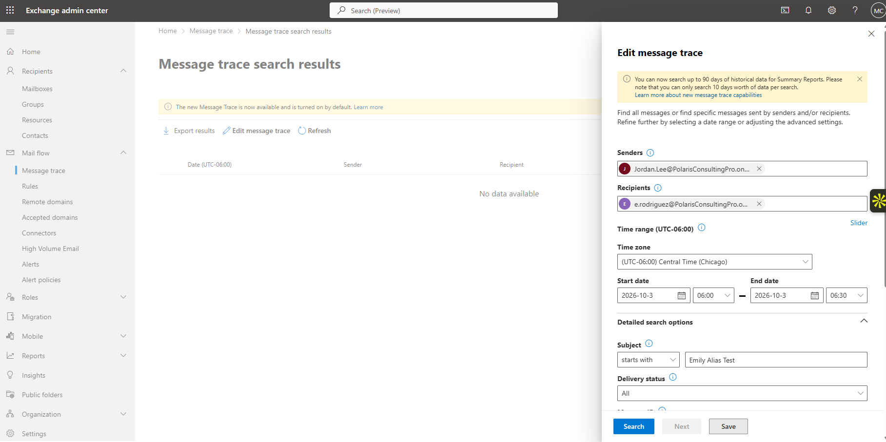

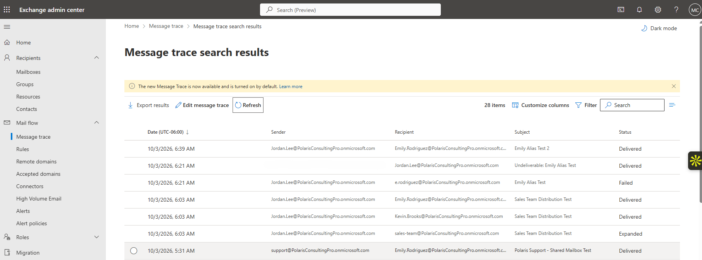

## Expected Outcome

Shared mailbox access, delegated sending, group delivery, and alias delivery all function correctly, with traceable evidence for both the failed and successful alias tests.

## Validation

- Shared mailbox created and visible in Exchange Online.
- Full Access and Send As delegation confirmed.
- Sales distribution group created with intended owner and members.
- Alias configuration verified.
- Initial alias test failed; second test delivered successfully.
- Message Trace confirmed the final delivery state.

## Security Considerations

- Mailbox delegation was limited to the users required by the scenario.
- The failed delivery was investigated before any broad security or mail-flow changes were attempted.

## Common Issues and Troubleshooting

The first alias test returned `550 5.1.10 RecipientNotFound`. The alias configuration itself was correct. Clearing the stale Outlook AutoComplete recipient and re-entering the address resolved the problem. Message Trace distinguished the failed attempt from the successful retest.

## Key Takeaways

- Exchange configuration and client-side recipient caching can produce similar delivery symptoms and should be checked separately.
- Message Trace provides stronger delivery evidence than relying only on the sender or recipient mailbox view.
- A successful configuration should be validated through actual mail flow, not only through the admin portal.
