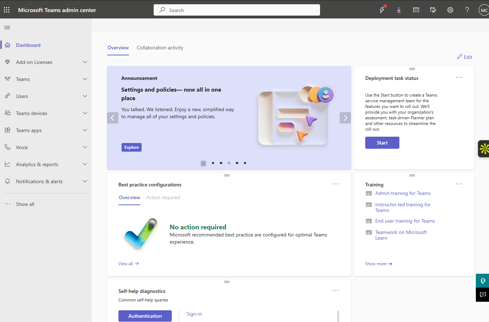
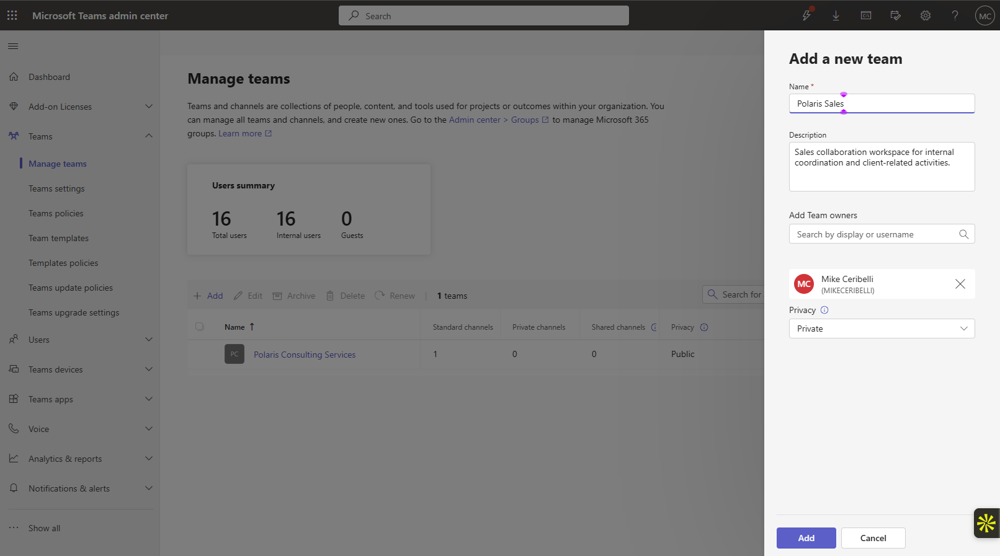
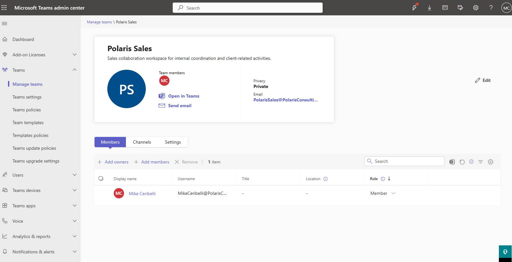
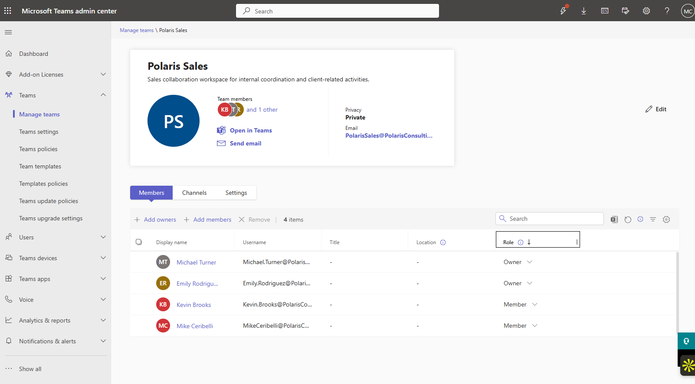
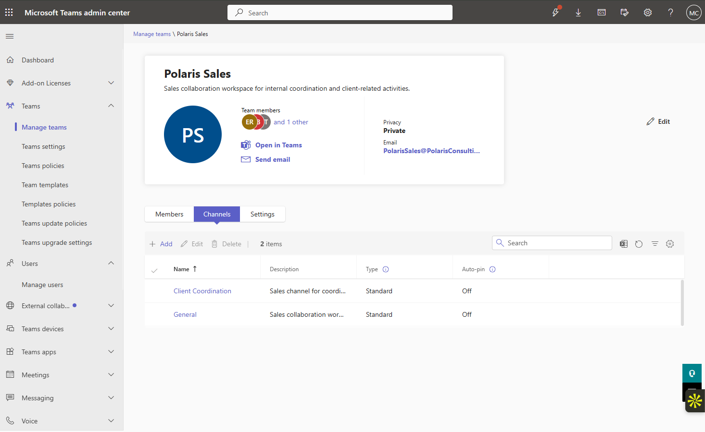
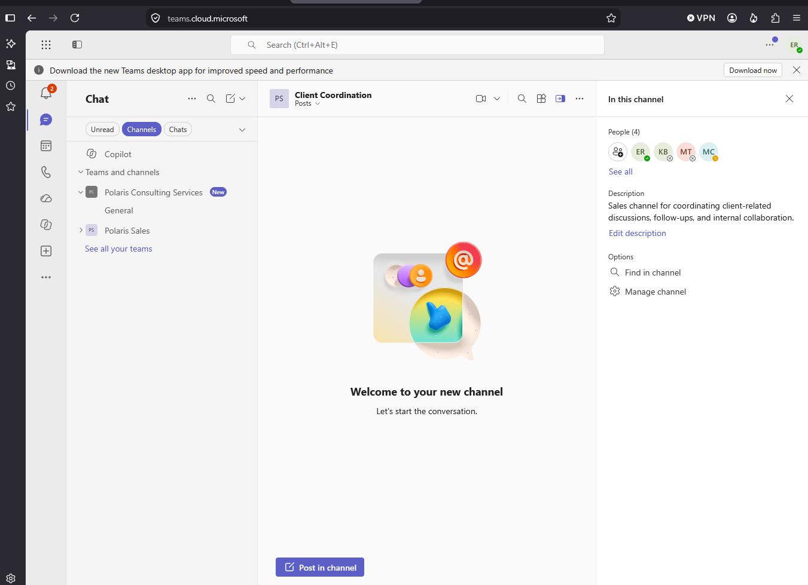
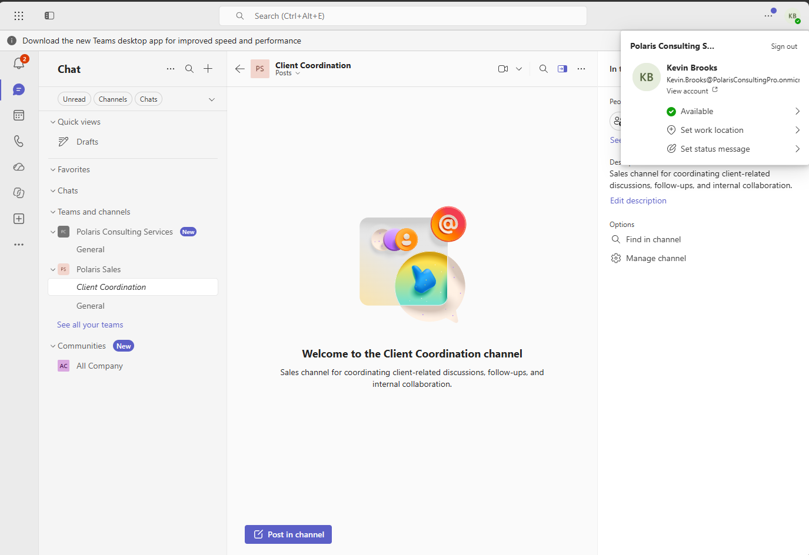
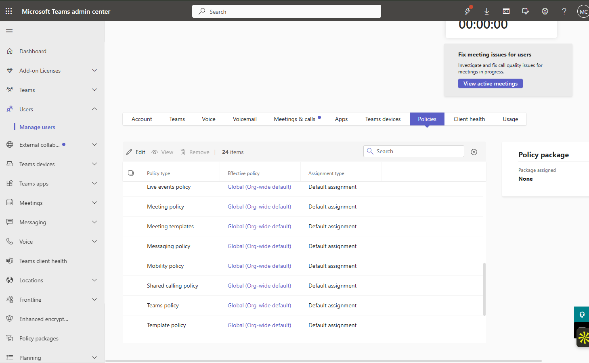
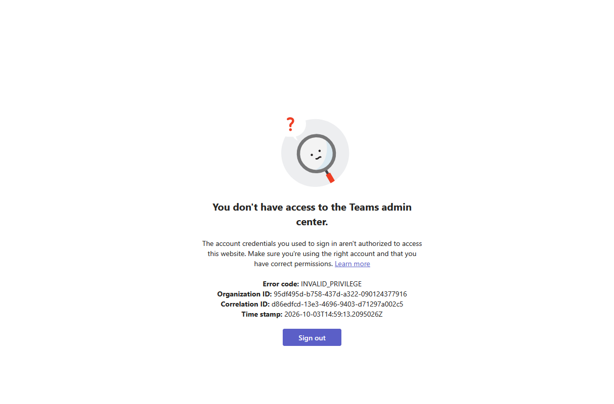
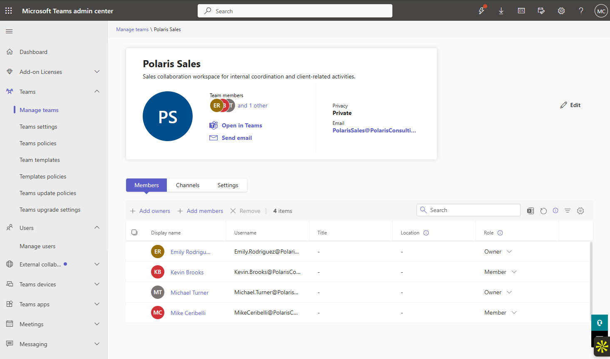

# Lab 05 — Microsoft Teams Administration

**Status:** Complete

## Overview

Builds a private departmental Team, defines business ownership, validates channel access, reviews effective policies, and confirms the boundary between Teams usage and Teams administration.

## Scenario

The Sales department required a private collaboration space with clearly defined owners and members. The lab also tested whether a normal licensed user could enter the Teams Admin Center.

## Objectives

- Create a private Sales team.
- Assign business owners and members.
- Create the Client Coordination channel.
- Validate member access.
- Review effective Teams policies.
- Confirm that normal Teams access does not grant administrative portal access.

## Tools and Services Used

- Microsoft Teams
- Teams Admin Center
- Microsoft 365 groups

## Administrative Workflow

The portal procedures below reflect the navigation used during this lab. Microsoft occasionally changes portal labels or menu placement, but the administrative sequence and validation points remain the same.

### Step 1 — Review the existing Teams environment

The Teams Admin Center was reviewed before creating the new departmental workspace.

<strong>Portal procedure</strong>

**Navigation:** Teams admin center → Teams → Manage teams

1. Open the Teams admin center.
2. Go to **Teams → Manage teams**.
3. Review the existing tenant Teams before creating the departmental workspace.
4. Confirm that the new Sales team will not duplicate an existing Team.

### Step 2 — Create the Polaris Sales team

A private team was created for the Sales department.

<strong>Portal procedure</strong>

**Navigation:** Microsoft Teams → Teams → Create or join a team → Create team

1. Open Microsoft Teams.
2. Choose **Create or join a team**.
3. Select **Create team**.
4. Create the team from scratch.
5. Set the privacy to **Private**.
6. Name the team `Polaris Sales`.
7. Complete creation and allow Teams to provision the associated Microsoft 365 group and SharePoint site.

### Step 3 — Configure ownership and membership

Michael Turner and Emily Rodriguez were retained as business owners. Kevin Brooks and the administrative account remained members.

<strong>Portal procedure</strong>

**Navigation:** Teams admin center → Teams → Manage teams → Polaris Sales → Members

1. Open **Teams → Manage teams**.
2. Select `Polaris Sales`.
3. Open the **Members** view.
4. Set Michael Turner and Emily Rodriguez as **Owners**.
5. Set Kevin Brooks as a **Member**.
6. Keep the administrative creator account as **Member**, not business owner.
7. Save changes and confirm the final role list.

### Step 4 — Create and review channels

The team included the default General channel and a `Client Coordination` channel for the lab workflow.

<strong>Portal procedure</strong>

**Navigation:** Microsoft Teams → Polaris Sales → More options → Add channel

1. Open the `Polaris Sales` team.
2. Open the team menu and select **Add channel**.
3. Name the channel `Client Coordination`.
4. Use the standard channel type for this workflow.
5. Create the channel.
6. Confirm that both **General** and **Client Coordination** appear.

### Step 5 — Validate user access

Emily Rodriguez and Kevin Brooks were used to confirm that the intended users could open the team and Client Coordination channel.

<strong>Portal procedure</strong>

**Navigation:** Microsoft Teams → Sign in as team members → Polaris Sales

1. Open a user session for Emily Rodriguez.
2. Confirm that `Polaris Sales` and `Client Coordination` are visible and accessible.
3. Repeat the check with Kevin Brooks.
4. Verify that both users can access the channel without administrative privileges.

### Step 6 — Review effective policies

The user's Teams policies were reviewed. Default org-wide policies were sufficient, so no unnecessary custom policy was created.

<strong>Portal procedure</strong>

**Navigation:** Teams admin center → Users → Manage users → <user> → Policies

1. Open **Users → Manage users**.
2. Select Emily Rodriguez.
3. Review the policy assignments for apps, meetings, messaging, and Teams.
4. Confirm that the org-wide default policies are applied.
5. Do not create a custom policy unless the scenario requires behavior that the defaults cannot provide.

### Step 7 — Confirm the administrative boundary

A normal user could use Teams but received an `INVALID_PRIVILEGE` error in the Teams Admin Center. No admin role was added to bypass the restriction.

<strong>Portal procedure</strong>

**Navigation:** Teams admin center → Attempted admin-center access from standard user

1. From Emily Rodriguez's user session, attempt to open the Teams admin center.
2. Confirm the `INVALID_PRIVILEGE` response.
3. Verify separately that normal Teams client access still works.
4. Treat the error as an administrative authorization boundary rather than a Teams licensing failure.

### Step 8 — Revalidate the final membership state

The final ownership and membership were reviewed after adjusting the creator account back to member.

<strong>Portal procedure</strong>

**Navigation:** Teams admin center → Teams → Manage teams → Polaris Sales → Members

1. Return to the `Polaris Sales` membership view.
2. Confirm Michael Turner and Emily Rodriguez are Owners.
3. Confirm Kevin Brooks and the administrative creator account are Members.
4. Capture the final state after correcting any creator-role drift.

## Expected Outcome

The Sales team is accessible to its intended users, business ownership is correct, default Teams policies remain sufficient, and administrative access remains restricted.

## Validation

- Polaris Sales created as a private Team.
- Owners and members matched the planned business roles.
- Client Coordination channel accessible to intended users.
- Default policy assignments verified.
- Teams Admin Center access denied to the non-admin user as expected.

## Security Considerations

- No Teams administrator role was granted simply to remove the expected admin-center restriction.
- Business ownership was separated from the technical creator account.
- No premium Teams add-on or unnecessary custom policy was introduced.

## Common Issues and Troubleshooting

The `INVALID_PRIVILEGE` message in the Teams Admin Center was initially easy to misread as a licensing issue. User access to the Teams client was already working; the error correctly reflected an administrative permission boundary.

## Key Takeaways

- Teams service access and Teams administrative access are separate permission models.
- Business ownership should be explicit rather than left with the account that happened to create the Team.
- Default policies are often preferable when they already satisfy the operational requirement.
