# Lab 06 — SharePoint and Teams Integration

**Status:** Complete

## Overview

Traces how a standard Teams channel maps to SharePoint storage and validates member access without adding unnecessary direct permissions.

## Scenario

The existing Polaris Sales team needed file collaboration through the Client Coordination channel. The administration task was to locate the backing SharePoint site, review membership, and validate end-user document access.

## Objectives

- Locate the SharePoint site associated with the Sales team.
- Review the Documents library and channel folder structure.
- Validate Teams-to-SharePoint file integration.
- Confirm site membership and permissions.
- Test document access for two Sales users.
- Avoid unnecessary direct sharing when group-based access already works.

## Tools and Services Used

- SharePoint Online
- SharePoint Admin Center
- Microsoft Teams
- Microsoft 365 groups

## Administrative Workflow

The portal procedures below reflect the navigation used during this lab. Microsoft occasionally changes portal labels or menu placement, but the administrative sequence and validation points remain the same.

### Step 1 — Locate the Polaris Sales site

The SharePoint site associated with the private Sales team was identified and reviewed.

<strong>Portal procedure</strong>

**Navigation:** SharePoint admin center → Active sites → Polaris Sales

1. Open the SharePoint admin center.
2. Go to **Active sites**.
3. Search for `Polaris Sales`.
4. Open the site details.
5. Confirm that it is the team site associated with the private Microsoft Teams team.

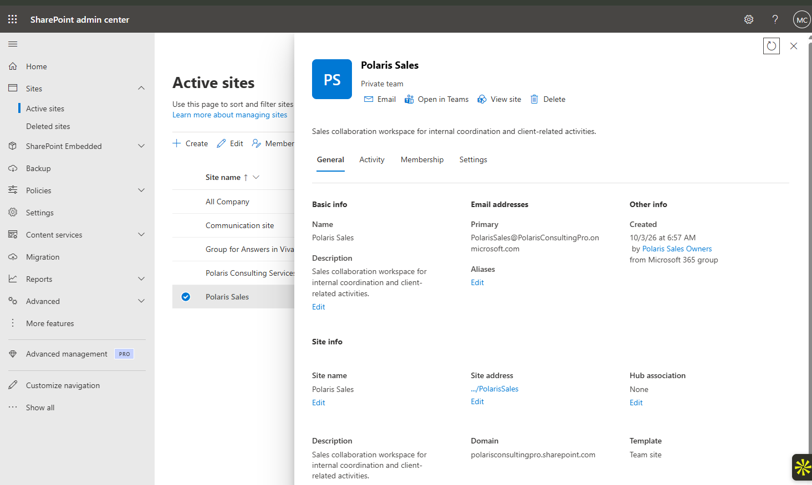

### Step 2 — Review the document library and channel structure

The Documents library and the Client Coordination channel folder were reviewed to confirm where standard-channel files were stored.

<strong>Portal procedure</strong>

**Navigation:** SharePoint Online → Polaris Sales site → Documents

1. Open the `Polaris Sales` SharePoint site.
2. Open **Documents**.
3. Review the folder structure created for the standard Teams channels.
4. Open the `Client Coordination` location and confirm the expected files.

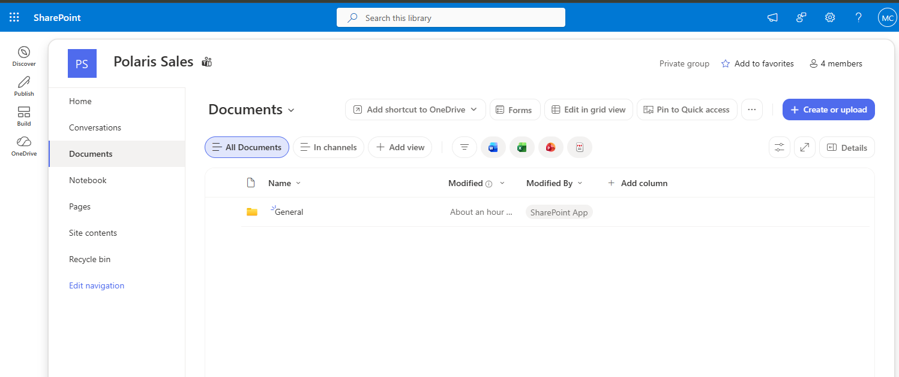

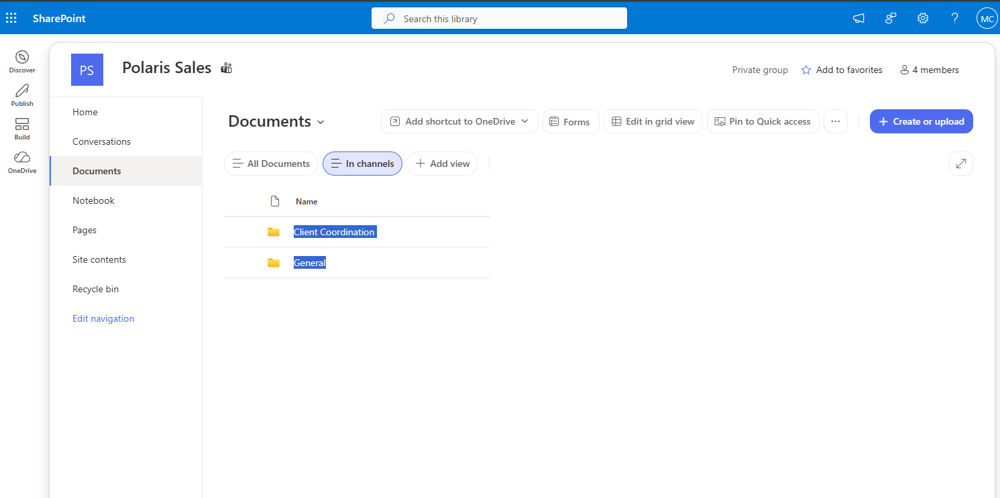

### Step 3 — Validate Teams and SharePoint file integration

The same channel content was opened from the Teams-connected experience and from SharePoint.

<strong>Portal procedure</strong>

**Navigation:** Microsoft Teams / SharePoint Online → Polaris Sales → Client Coordination → Shared / Files

1. Open `Polaris Sales` in Microsoft Teams.
2. Open the `Client Coordination` channel.
3. Open the channel's shared/files view.
4. Use **Open in SharePoint** when available.
5. Confirm that the same files are visible in the backing SharePoint document library.
6. Compare the Team channel location with the SharePoint folder.

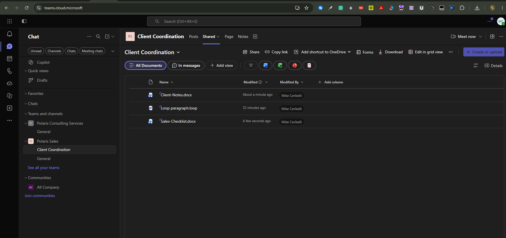

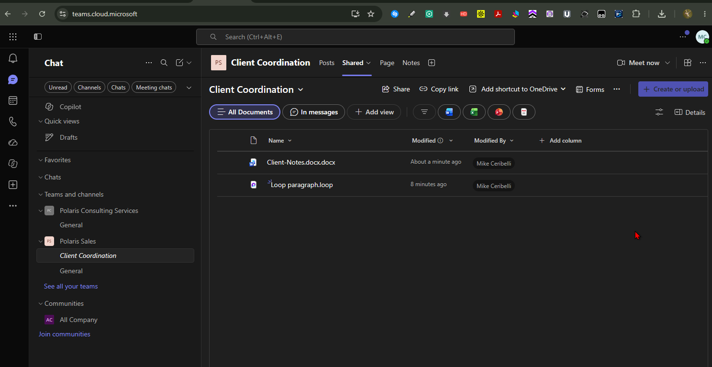

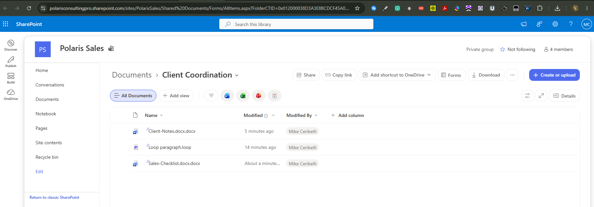

### Step 4 — Review site membership and permissions

The site members and the Owners / Members / Visitors permission model were inspected before making any access change.

<strong>Portal procedure</strong>

**Navigation:** SharePoint Online → Site settings / Site permissions → Advanced permissions / Manage access

1. Open the `Polaris Sales` site.
2. Open **Site permissions**.
3. Review the Owners, Members, and Visitors groups.
4. Open **Manage access** for a representative file when needed.
5. Confirm that access is inherited through the expected team/site membership.
6. Avoid adding direct permissions when group-based access already works.

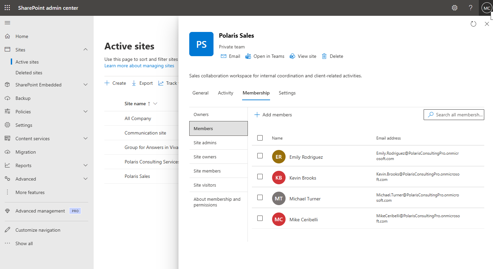

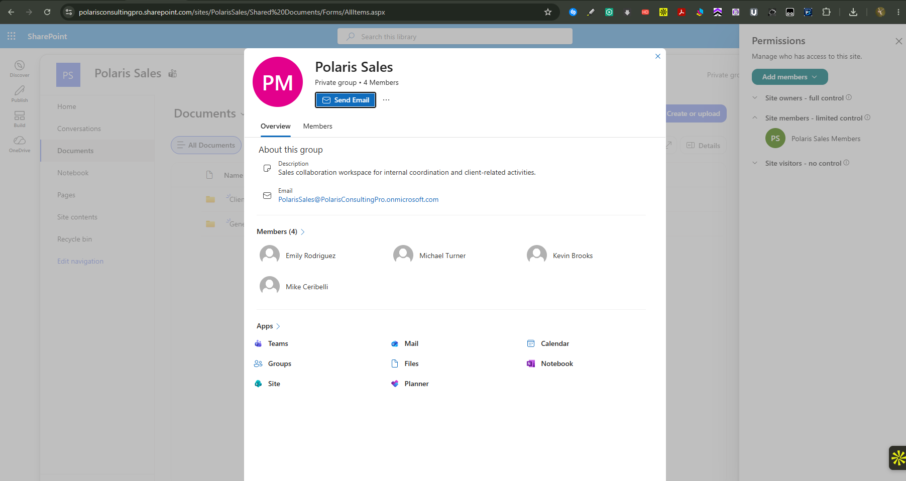

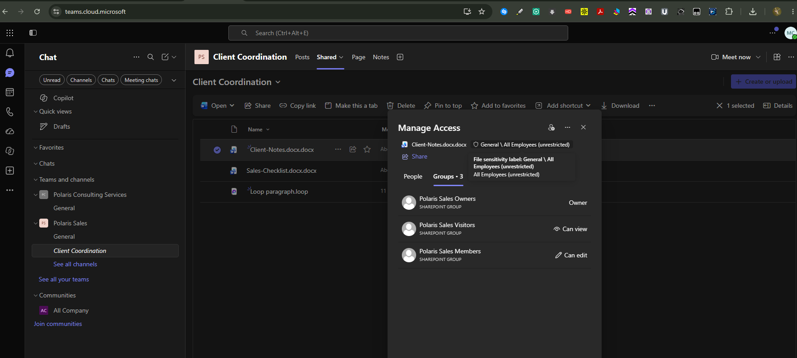

### Step 5 — Validate end-user access

Emily Rodriguez and Kevin Brooks opened the expected Sales documents successfully.

<strong>Portal procedure</strong>

**Navigation:** Microsoft Teams / SharePoint Online → Sign in as Emily and Kevin → open test documents

1. Sign in as Emily Rodriguez and open the `Client Coordination` content.
2. Open `Client-Notes.docx`.
3. Sign in as Kevin Brooks and open the same channel location.
4. Open `Sales-Checklist.docx`.
5. Confirm both users can reach the expected documents without direct sharing changes.

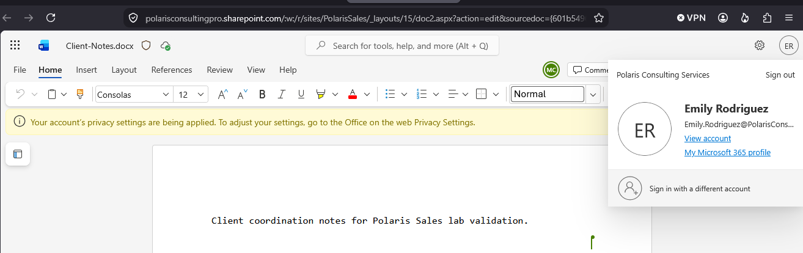

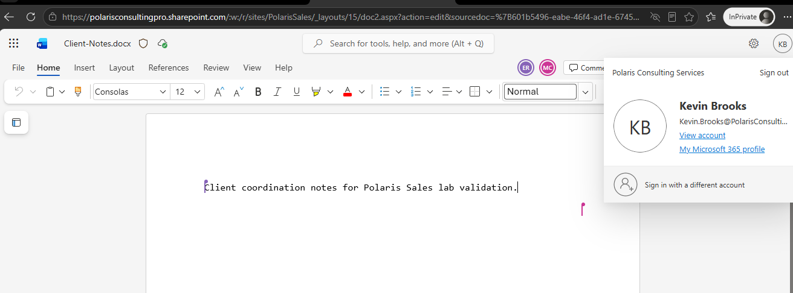

## Expected Outcome

Team members can access the channel files through Teams and SharePoint using the existing group-backed permissions, without extra direct sharing.

## Validation

- Backing SharePoint team site identified.
- Client Coordination files visible in both Teams and SharePoint.
- Expected site membership confirmed.
- Emily and Kevin successfully opened the test documents.
- No additional direct permission or sharing link was needed.

## Security Considerations

- Permission troubleshooting started with membership and effective access rather than granting direct permissions.
- No broad external sharing change was introduced.
- Working permissions were left intact instead of being deliberately broken to manufacture a troubleshooting result.

## Common Issues and Troubleshooting

An accidental duplicate `.docx` extension was corrected during the file exercise. The broader access investigation confirmed that no permission change was required because the existing Teams/SharePoint membership model was already working.

## Key Takeaways

- Standard Teams channels store files in the associated SharePoint team site.
- Teams membership and SharePoint access should be reviewed together during file-access troubleshooting.
- Direct permissions are a poor first response when group-backed access is already correctly configured.
