# Lab 08 — Microsoft Purview DLP and Sensitivity Labels

**Status:** Complete

## Overview

Configures information protection and a PCI-focused DLP simulation, then validates label propagation, content marking, sensitive-information detection, and policy-tip behavior.

## Scenario

Polaris required a controlled demonstration of internal sensitivity labeling and payment-card data protection without enabling broad production-style enforcement.

## Objectives

- Create and publish an internal sensitivity label.
- Apply a visible footer to labeled content.
- Create a PCI-focused DLP policy using synthetic test data.
- Keep the DLP policy in simulation with notifications.
- Validate sensitive-information detection and the user-facing policy tip.
- Review Purview activity, audit, alerts, and recommendations without expanding into unrelated premium features.

## Tools and Services Used

- Microsoft Purview portal
- Information Protection
- Data Loss Prevention
- Activity Explorer
- Audit
- Microsoft 365 Apps

## Administrative Workflow

The portal procedures below reflect the navigation used during this lab. Microsoft occasionally changes portal labels or menu placement, but the administrative sequence and validation points remain the same.

### Step 1 — Create the sensitivity label

The `Confidential - Internal` label was created for files and email with a visible footer and no encryption requirement.

<strong>Portal procedure</strong>

**Navigation:** Microsoft Purview portal → Solutions → Information Protection → Sensitivity labels → Create a label

1. Open the Microsoft Purview portal.
2. Go to **Solutions → Information Protection → Sensitivity labels**.
3. Select **Create a label**.
4. Name the label `Confidential - Internal`.
5. Scope it to files/data assets and email.
6. Leave encryption and access control disabled for this lab.
7. Configure a footer reading `Confidential - Internal | Polaris Consulting Services`.
8. Review and create the label.

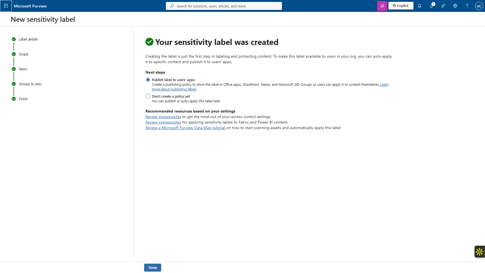

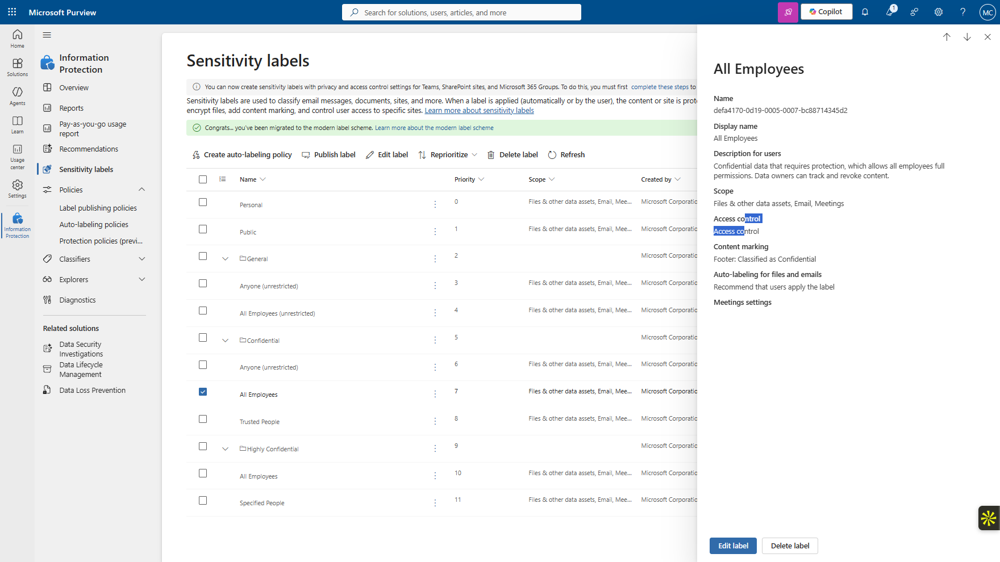

### Step 2 — Publish the label to pilot users

A publishing policy targeted the Sales test users so propagation could be validated without a tenant-wide rollout.

<strong>Portal procedure</strong>

**Navigation:** Microsoft Purview portal → Information Protection → Publishing policies → Publish labels

1. Open the label-publishing area.
2. Create a publishing policy for the `Confidential - Internal` label.
3. Select the label to publish.
4. Scope the publication to the Sales pilot users used in the lab.
5. Complete the policy and allow time for propagation.
6. Verify later from the user side that the label is available.

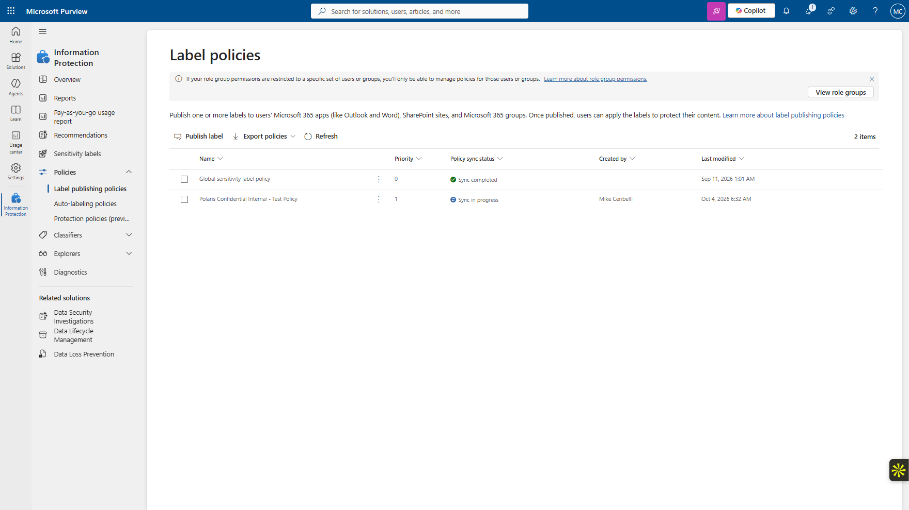

### Step 3 — Create the PCI DLP policy

The `Polaris PCI DLP - Test Policy` was created from the PCI template and scoped to Exchange, SharePoint, and OneDrive.

<strong>Portal procedure</strong>

**Navigation:** Microsoft Purview portal → Solutions → Data Loss Prevention → Policies → Create policy

1. Open **Solutions → Data Loss Prevention → Policies**.
2. Select **Create policy**.
3. Choose the PCI DSS template.
4. Name the policy `Polaris PCI DLP - Test Policy`.
5. Select Exchange, SharePoint, and OneDrive as locations.
6. Configure the credit-card sensitive-information condition for external sharing.
7. Use simulation with notifications rather than broad enforcement.
8. Complete the policy.

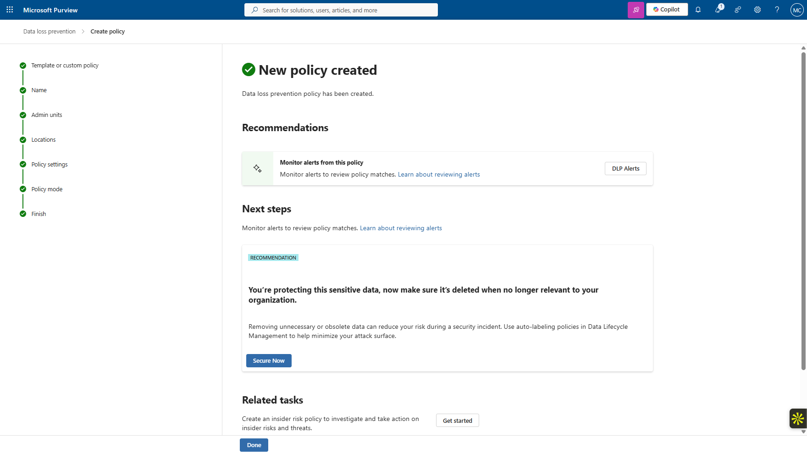

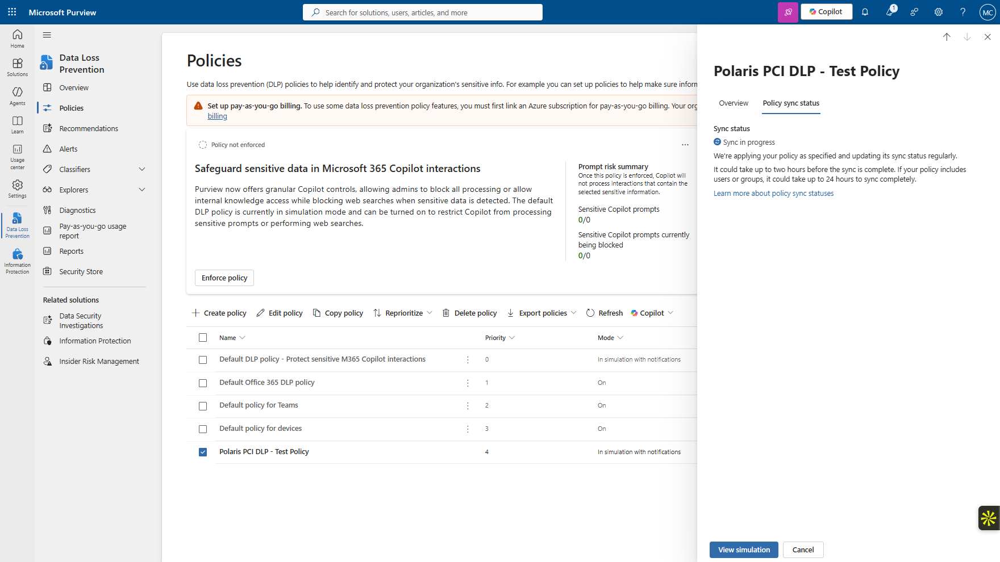

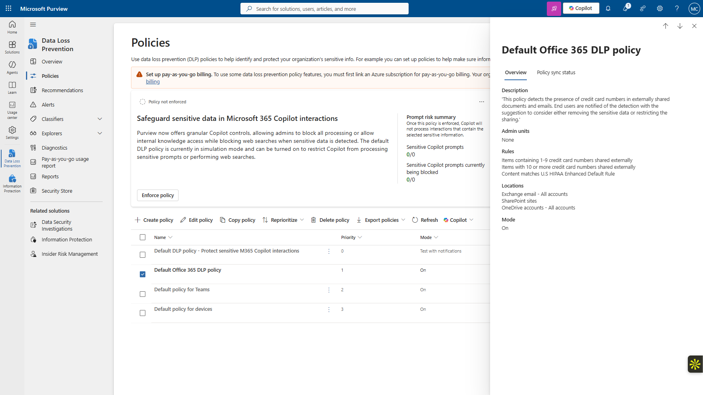

### Step 4 — Review the DLP policy list and simulation state

The policy remained in simulation with notifications. The dashboard continued to show asynchronous processing after the practical validation steps were complete.

<strong>Portal procedure</strong>

**Navigation:** Microsoft Purview portal → Data Loss Prevention → Policies / Simulation

1. Return to the DLP policy list.
2. Open `Polaris PCI DLP - Test Policy`.
3. Confirm that the policy is in simulation with notifications.
4. Review the simulation status and processing indicators.
5. Do not interpret an `In progress` dashboard state as proof that the user-facing detection failed.

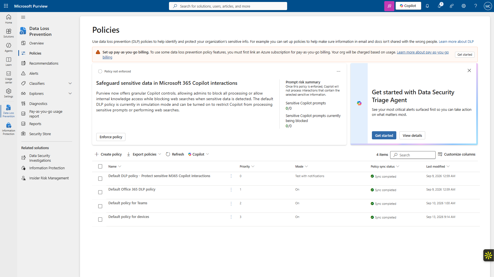

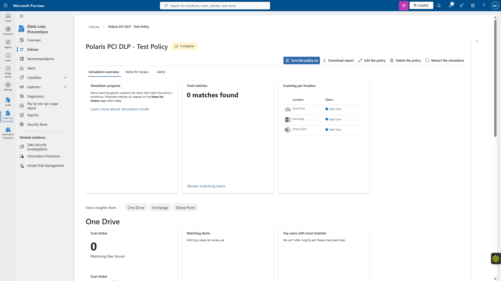

### Step 5 — Validate the user-facing DLP behavior

Synthetic payment-card data was used to trigger the DLP experience. The policy tip appeared and the external-sharing conflict was observed.

<strong>Portal procedure</strong>

**Navigation:** Microsoft 365 user workflow → Create test content → apply/share → observe policy tip

1. Use synthetic payment-card test data only.
2. Place the test content in a location covered by the DLP policy.
3. Attempt the external-sharing action that matches the policy condition.
4. Observe the sensitive-information detection and policy-tip behavior.
5. Confirm that the expected warning/conflict appears while the policy remains in simulation.

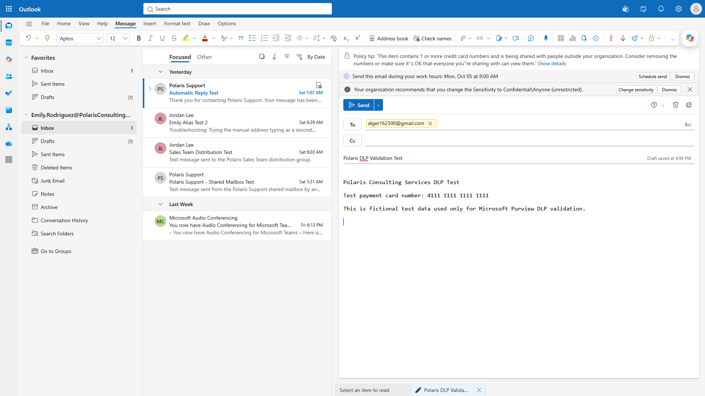

### Step 6 — Review supporting Purview surfaces

Activity Explorer, Audit, DLP alerts, recommendations, and the Purview solution overview were reviewed to document the broader operational context.

<strong>Portal procedure</strong>

**Navigation:** Microsoft Purview portal → Activity Explorer / Audit / DLP Alerts / Recommendations

1. Open **Activity Explorer** and review whether events are available.
2. Open **Audit** and review the tenant setup state.
3. Open **DLP Alerts** and document the baseline.
4. Open **Recommendations** for DLP-related guidance.
5. Avoid enabling additional premium or organizational setup solely to populate the portfolio.

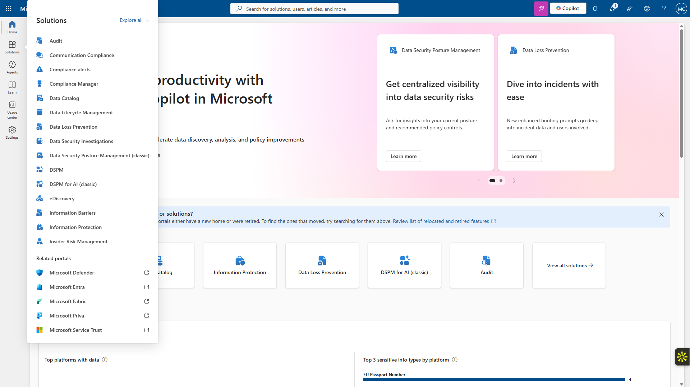

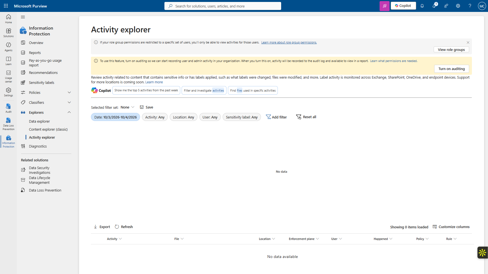

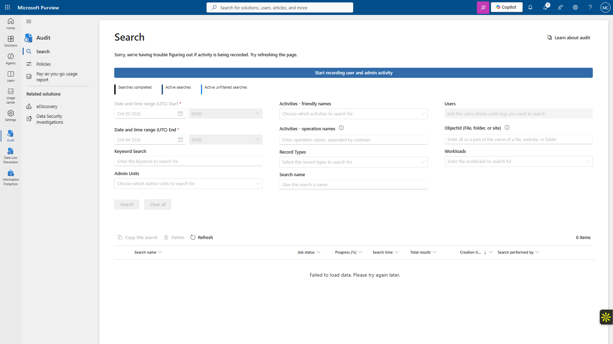

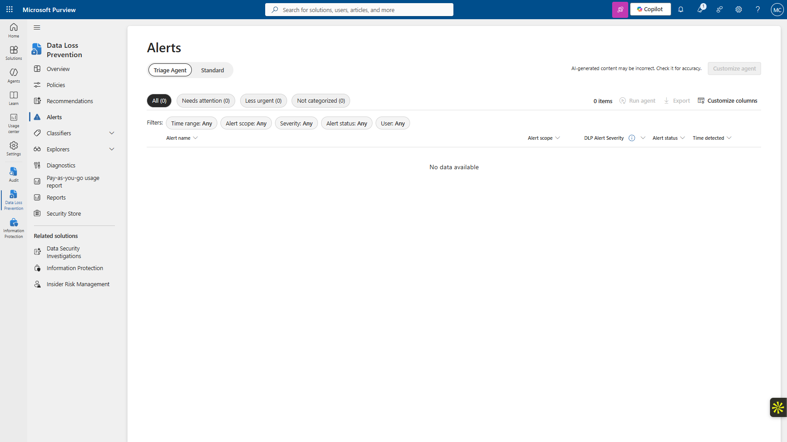

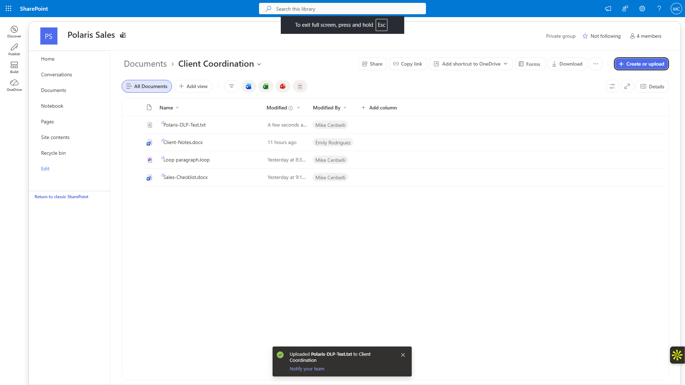

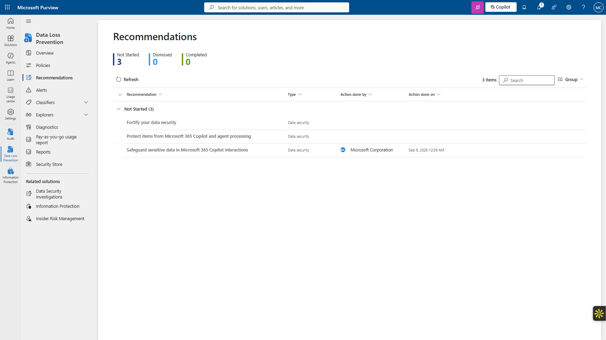

## Expected Outcome

The sensitivity label is available to the pilot users, labeled content shows the configured footer, and the DLP simulation identifies synthetic payment-card data without broad enforcement.

## Validation

- `Confidential - Internal` propagated and could be applied.
- Configured footer appeared on labeled content.
- Synthetic credit-card data was detected.
- A DLP policy tip appeared during the test.
- The policy remained in simulation rather than broad enforcement.

## Security Considerations

- Only synthetic payment-card data was used.
- The policy remained in simulation with notifications.
- No Endpoint DLP, premium audit trial, insider-risk expansion, or broad auto-labeling was enabled.
- The asynchronous simulation dashboard state was documented rather than misrepresented.

## Common Issues and Troubleshooting

The DLP simulation continued to show `In progress` even after the practical detection and policy-tip behavior had been confirmed. Because the relevant user-facing control had already been validated, the remaining dashboard state was treated as a reporting/processing limitation rather than a reason to force additional configuration.

## Key Takeaways

- Policy creation, propagation, detection, reporting, and enforcement are separate stages.
- Simulation provides useful validation without immediately imposing broad enforcement.
- Real validation should rely on observed control behavior, not solely on whether a dashboard has finished asynchronous processing.
