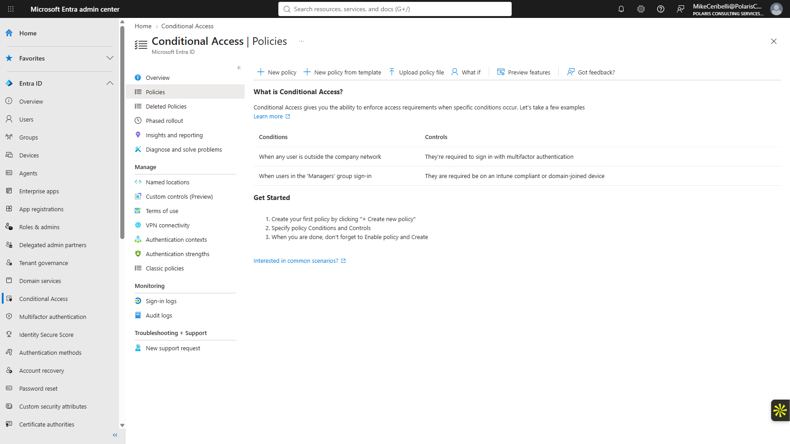
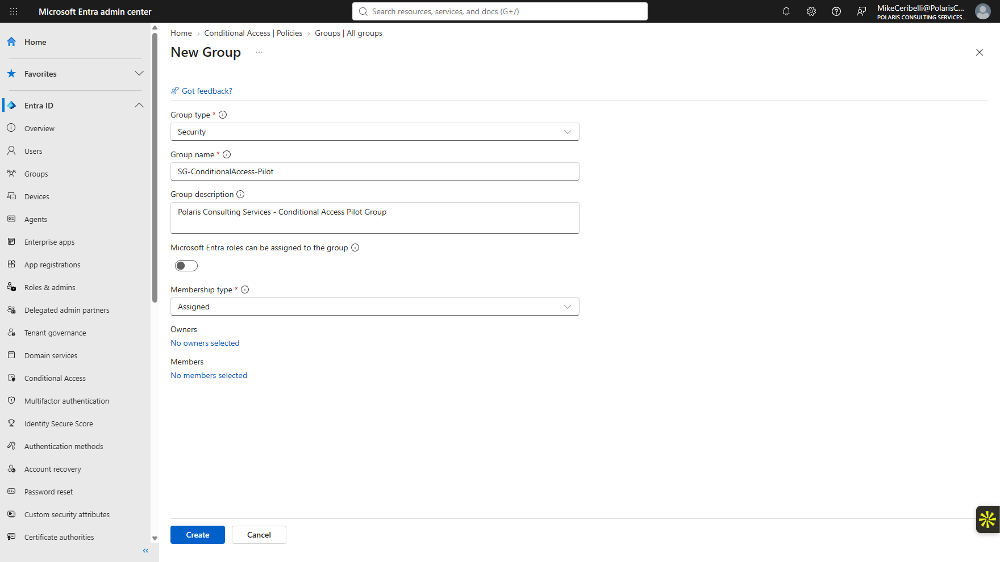
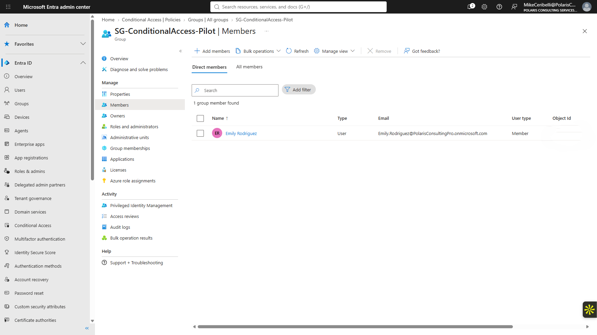
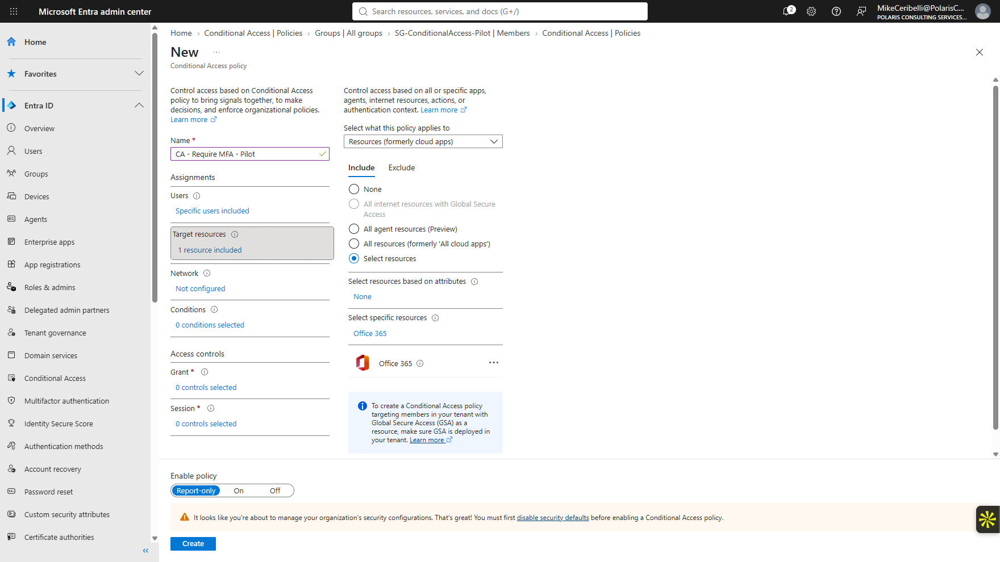
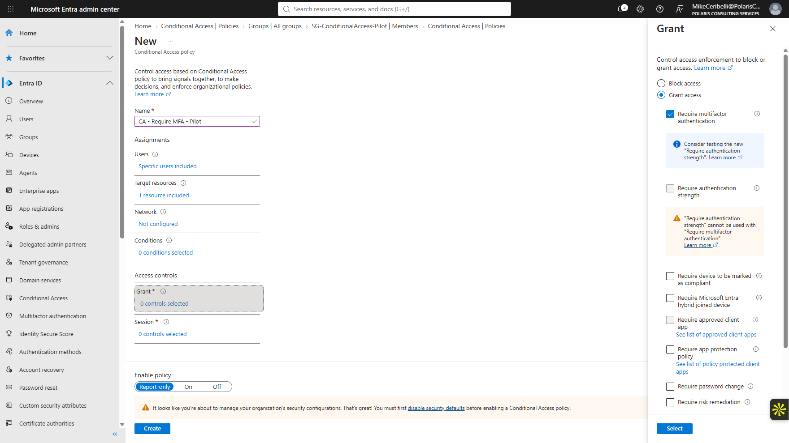
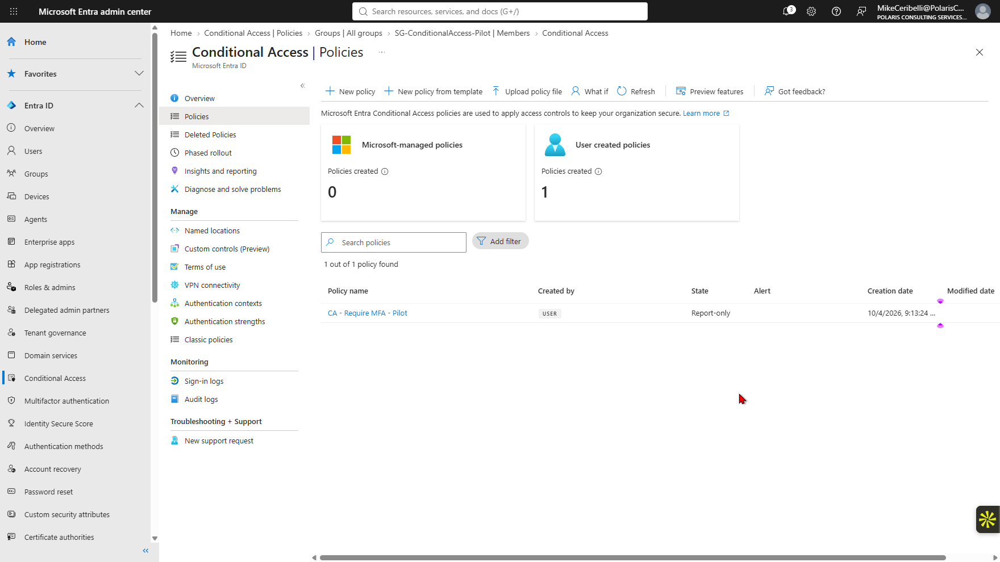
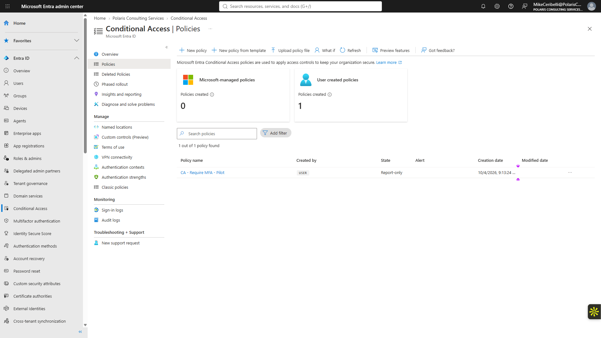
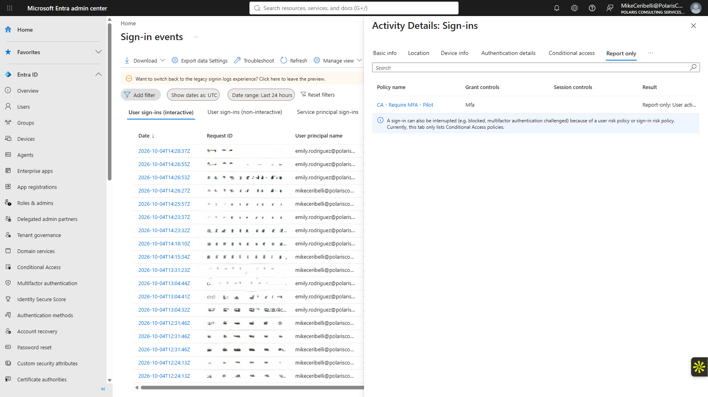
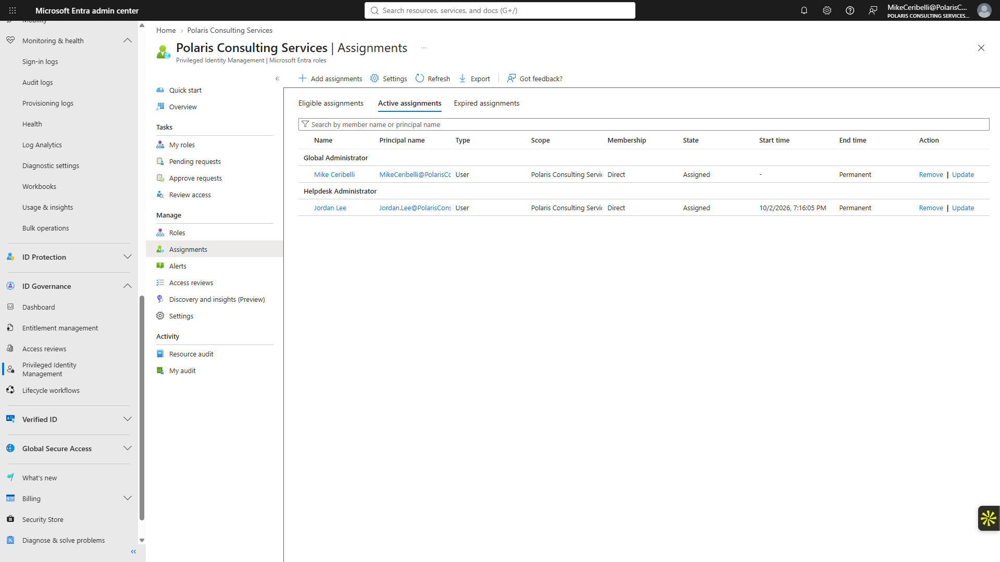
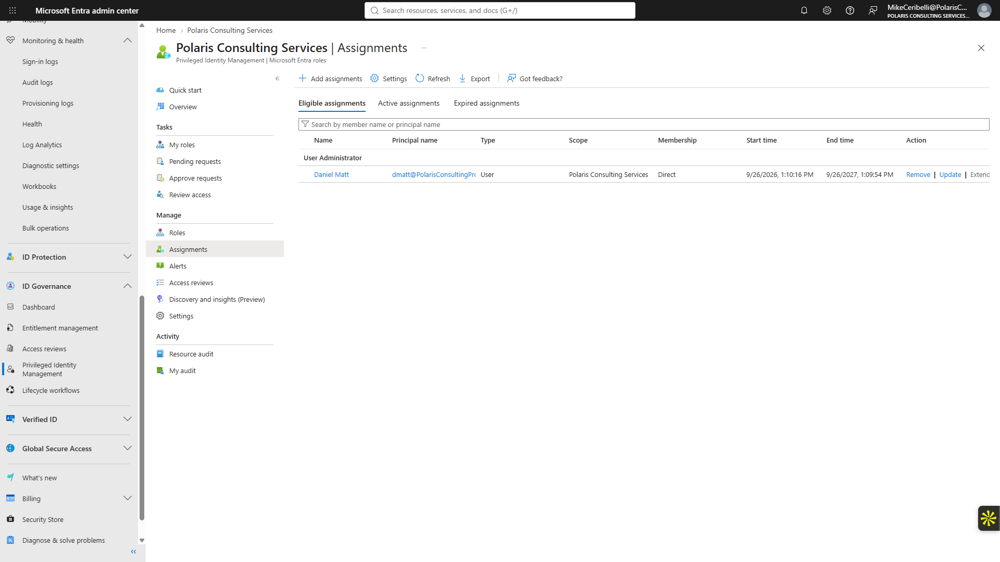

# Lab 09 — Conditional Access and Privileged Identity Management

**Status:** Complete

## Overview

Builds a narrowly scoped MFA policy in report-only mode and compares standing privilege with an eligible, time-bound PIM assignment.

## Scenario

The tenant needed a safe Conditional Access pilot that could be evaluated without replacing Security Defaults or enforcing a new policy organization-wide.

## Objectives

- Create a pilot security group.
- Target a Conditional Access policy to the pilot only.
- Require MFA for Office 365 in report-only mode.
- Validate the policy through Entra sign-in logs.
- Review active and eligible PIM assignments.
- Preserve the existing Security Defaults configuration.

## Tools and Services Used

- Microsoft Entra admin center
- Conditional Access
- Sign-in logs
- Privileged Identity Management
- Microsoft Authenticator

## Administrative Workflow

The portal procedures below reflect the navigation used during this lab. Microsoft occasionally changes portal labels or menu placement, but the administrative sequence and validation points remain the same.

### Step 1 — Review the Conditional Access baseline

The Conditional Access area was reviewed before creating a custom policy. Security Defaults remained enabled.

<strong>Portal procedure</strong>

**Navigation:** Microsoft Entra admin center → Protection → Conditional Access → Policies

1. Open the Microsoft Entra admin center.
2. Go to **Protection → Conditional Access → Policies**.
3. Review existing policies before creating the pilot.
4. Confirm the Security Defaults state separately so its behavior is not confused with the custom policy.

### Step 2 — Create the pilot group

`SG-ConditionalAccess-Pilot` was created and Emily Rodriguez was used as the pilot member.

<strong>Portal procedure</strong>

**Navigation:** Microsoft Entra admin center → Identity → Groups → All groups → New group

1. Create a Security group named `SG-ConditionalAccess-Pilot`.
2. Use **Assigned** membership.
3. Leave role-assignable disabled.
4. Add Emily Rodriguez as the pilot member.
5. Save the group and verify membership.

### Step 3 — Create the MFA policy

`CA - Require MFA - Pilot` was configured for the pilot group and Office 365.

<strong>Portal procedure</strong>

**Navigation:** Microsoft Entra admin center → Protection → Conditional Access → Policies → New policy

1. Select **New policy**.
2. Name the policy `CA - Require MFA - Pilot`.
3. Under **Users**, include `SG-ConditionalAccess-Pilot`.
4. Under **Target resources**, select Office 365.
5. Leave unrelated conditions unconfigured unless the scenario requires them.
6. Continue to the grant controls.

### Step 4 — Configure the grant control

The grant requirement was set to multifactor authentication.

<strong>Portal procedure</strong>

**Navigation:** Microsoft Entra admin center → Conditional Access policy → Access controls → Grant

1. Open **Access controls → Grant**.
2. Select **Grant access**.
3. Select **Require multifactor authentication**.
4. Save the grant-control selection.
5. Review the policy summary before enabling any state.

### Step 5 — Keep the policy in report-only mode

The policy was intentionally left in report-only mode so matching and impact could be reviewed without changing the tenant's active sign-in behavior.

<strong>Portal procedure</strong>

**Navigation:** Microsoft Entra admin center → Conditional Access policy → Enable policy

1. Set **Enable policy** to **Report-only**.
2. Create/save the policy.
3. Return to the policy list.
4. Confirm that the state is Report-only rather than On.

### Step 6 — Validate through sign-in logs

A fresh Office 365 sign-in was inspected. The policy reported `User action required`, confirming that the user and resource matched and MFA would be required if the policy were enabled.

<strong>Portal procedure</strong>

**Navigation:** Microsoft Entra admin center → Monitoring & health → Sign-in logs → select sign-in → Conditional Access

1. Perform a fresh Office 365 sign-in with the pilot user.
2. Open **Monitoring & health → Sign-in logs**.
3. Locate the sign-in event.
4. Open the event and select the **Conditional Access** details.
5. Find `CA - Require MFA - Pilot`.
6. Confirm the report-only result and the `User action required` evaluation.
7. Use this log evidence to distinguish the pilot policy from Security Defaults MFA behavior.

### Step 7 — Review privileged assignments

PIM was inspected to compare a direct Active/Permanent assignment with an Eligible/Time-bound assignment.

<strong>Portal procedure</strong>

**Navigation:** Microsoft Entra admin center → Identity governance / Privileged Identity Management → Microsoft Entra roles → Assignments

1. Open **Privileged Identity Management**.
2. Open **Microsoft Entra roles**.
3. Review the assignment lists.
4. Compare Jordan Lee's direct Active/Permanent Helpdesk Administrator assignment with an existing Eligible/Time-bound assignment.
5. Do not modify the privileged assignments during the comparison.

## Expected Outcome

The pilot policy evaluates the intended sign-in and reports the expected MFA requirement while remaining non-enforcing, and PIM demonstrates the difference between standing and eligible privilege.

## Validation

- Pilot group created and scoped correctly.
- Office 365 selected as the target resource.
- Require MFA selected as the grant control.
- Policy remained Report-only.
- Sign-in logs showed the policy matched the pilot sign-in.
- Security Defaults remained enabled.
- Active and eligible PIM assignment types were reviewed.

## Security Considerations

- Report-only mode was used before enforcement.
- Security Defaults were not disabled merely to activate the pilot.
- No extra privileged role was added for the lab.
- PIM was reviewed without altering the existing privileged assignments.

## Common Issues and Troubleshooting

The pilot user's MFA experience had to be interpreted carefully because Security Defaults was already active. The sign-in log, rather than the presence of an MFA prompt alone, was used to prove the Conditional Access policy evaluation.

## Key Takeaways

- Conditional Access evaluation and Conditional Access enforcement are separate states.
- Sign-in logs are the authoritative place to validate which policy matched a sign-in.
- Least privilege includes both what a role can do and how long that privilege remains active.
