# Lab 10 — Intune Endpoint Management Baseline

**Status:** Complete

## Overview

Establishes an Intune management baseline with pilot targeting, a Windows compliance policy, a Settings Catalog profile, and an explicit zero-device starting state.

## Scenario

Endpoint-management controls needed to be prepared without enrolling the physical workstation. The first phase therefore focused on tenant state, enrollment settings, pilot scoping, and policy creation.

## Objectives

- Review Intune tenant and enrollment status.
- Confirm the initial zero-device baseline.
- Create a pilot group.
- Create a Windows compliance policy.
- Create a SmartScreen configuration profile.
- Assign policies narrowly and document that assignment is not the same as delivery.
- Review Endpoint Security and Defender for Endpoint integration state.

## Tools and Services Used

- Microsoft Intune admin center
- Microsoft Entra ID
- Windows compliance policies
- Settings Catalog
- Endpoint Security

## Administrative Workflow

The portal procedures below reflect the navigation used during this lab. Microsoft occasionally changes portal labels or menu placement, but the administrative sequence and validation points remain the same.

### Step 1 — Review enrollment and MDM state

The Intune tenant, MDM scope, and Windows enrollment settings were reviewed before any device was introduced.

<strong>Portal procedure</strong>

**Navigation:** Microsoft Intune admin center → Tenant administration → Tenant status / Devices → Enrollment

1. Open the Microsoft Intune admin center.
2. Review **Tenant administration → Tenant status** and confirm Microsoft Intune is the MDM authority.
3. Go to **Devices → Enrollment**.
4. Review Windows automatic enrollment and the current MDM user scope.
5. Review platform enrollment restrictions without changing the physical-device safety posture.

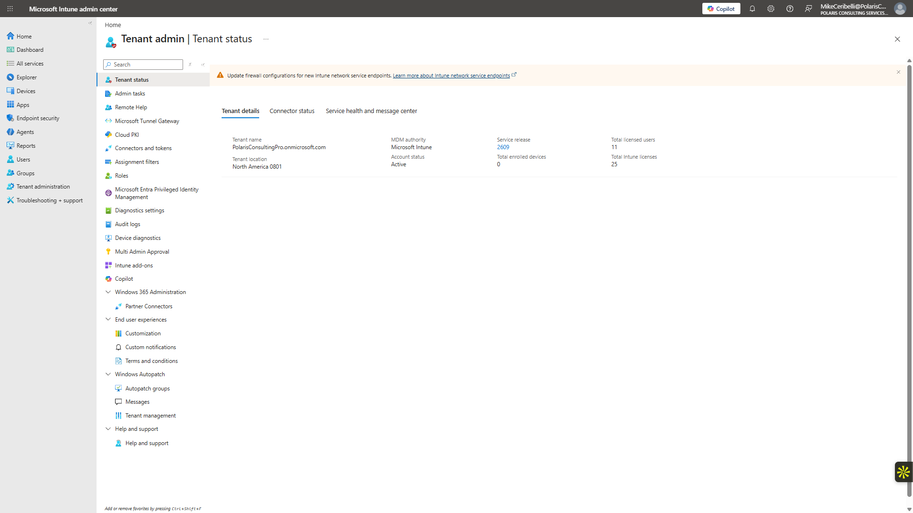

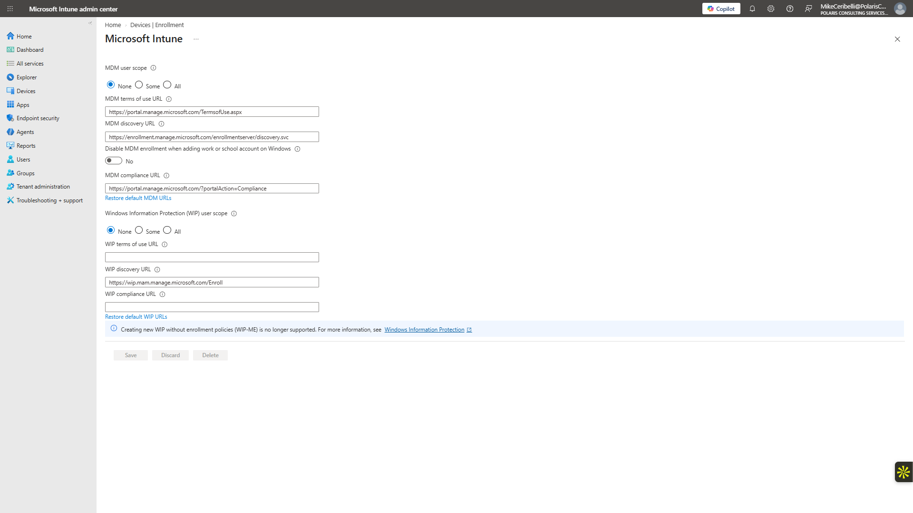

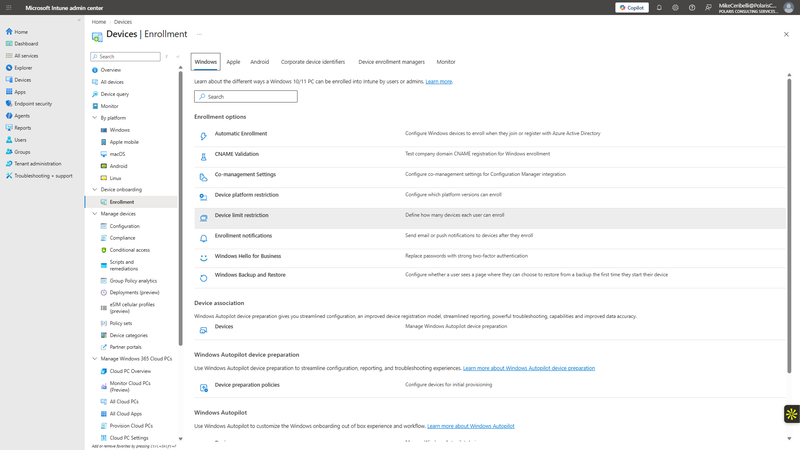

### Step 2 — Confirm the zero-device baseline

The device inventory was intentionally empty at the start of the lab.

<strong>Portal procedure</strong>

**Navigation:** Microsoft Intune admin center → Devices → All devices

1. Open **Devices → All devices**.
2. Confirm that no device is enrolled at this stage.
3. Record the zero-device state before any endpoint-validation work begins.

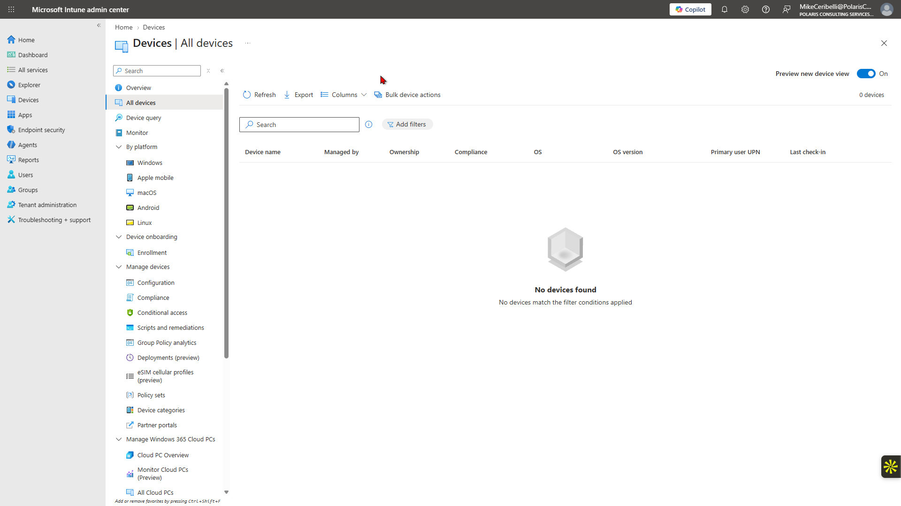

### Step 3 — Create and review the pilot group

`SG-Intune-Pilot` was created for narrow assignment rather than targeting all users or devices.

<strong>Portal procedure</strong>

**Navigation:** Microsoft Entra admin center → Identity → Groups → All groups → New group

1. Create `SG-Intune-Pilot` as a Security group.
2. Use Assigned membership.
3. Add Emily Rodriguez as the pilot user.
4. Verify the group membership before policy assignment.

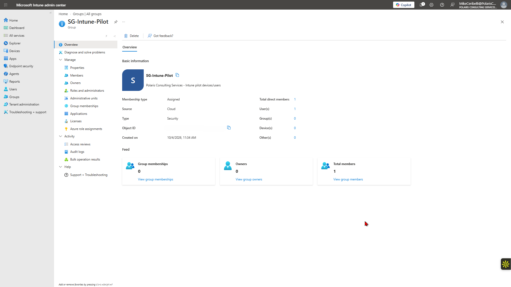

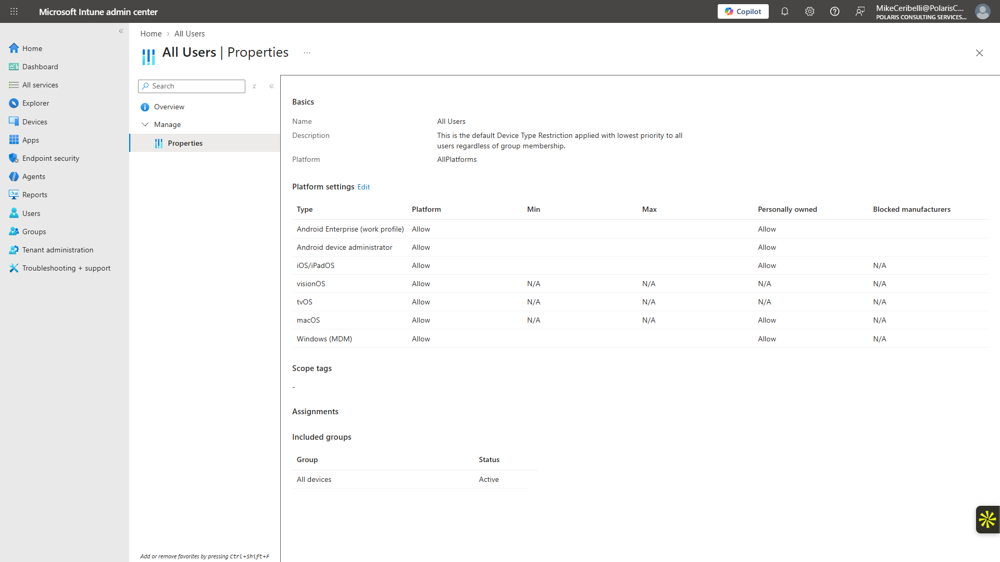

### Step 4 — Create the Windows compliance policy

`Polaris - Windows Compliance - Pilot` required Windows Firewall and marked a device noncompliant immediately if the requirement was not met.

<strong>Portal procedure</strong>

**Navigation:** Microsoft Intune admin center → Devices → Compliance policies → Policies → Create policy

1. Open **Devices → Compliance policies → Policies**.
2. Select **Create policy**.
3. Choose **Windows 10 and later**.
4. Name the policy `Polaris - Windows Compliance - Pilot`.
5. Under device security, set **Firewall** to **Require**.
6. Configure the noncompliance action to mark the device noncompliant immediately.
7. Assign the policy to `SG-Intune-Pilot`.
8. Create the policy and review the assignment.

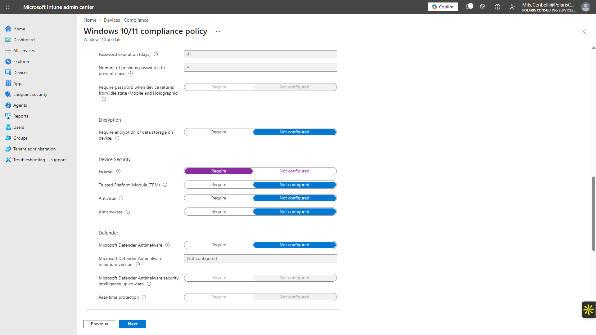

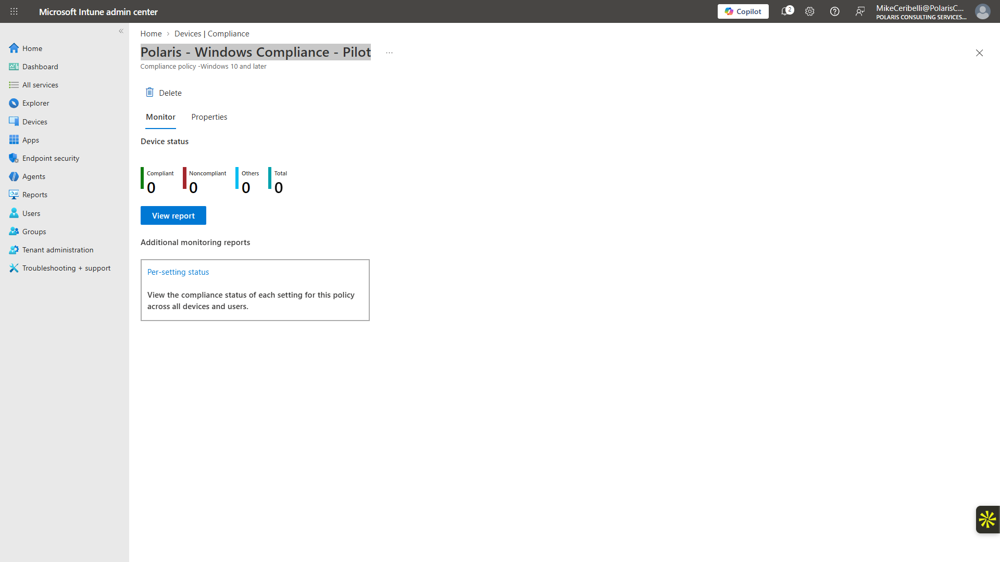

### Step 5 — Create the SmartScreen profile

A Settings Catalog profile enabled Microsoft Defender SmartScreen in Microsoft Edge and was assigned to the same pilot group.

<strong>Portal procedure</strong>

**Navigation:** Microsoft Intune admin center → Devices → Configuration → Create → New policy → Settings catalog

1. Open the Windows configuration-profile area.
2. Create a new policy for **Windows 10 and later** using **Settings catalog**.
3. Name it `Polaris - Windows Security Configuration - Pilot`.
4. Search settings for Microsoft Edge SmartScreen.
5. Enable **Configure Microsoft Defender SmartScreen**.
6. Assign the profile to `SG-Intune-Pilot`.
7. Create the policy and review the deployment state.

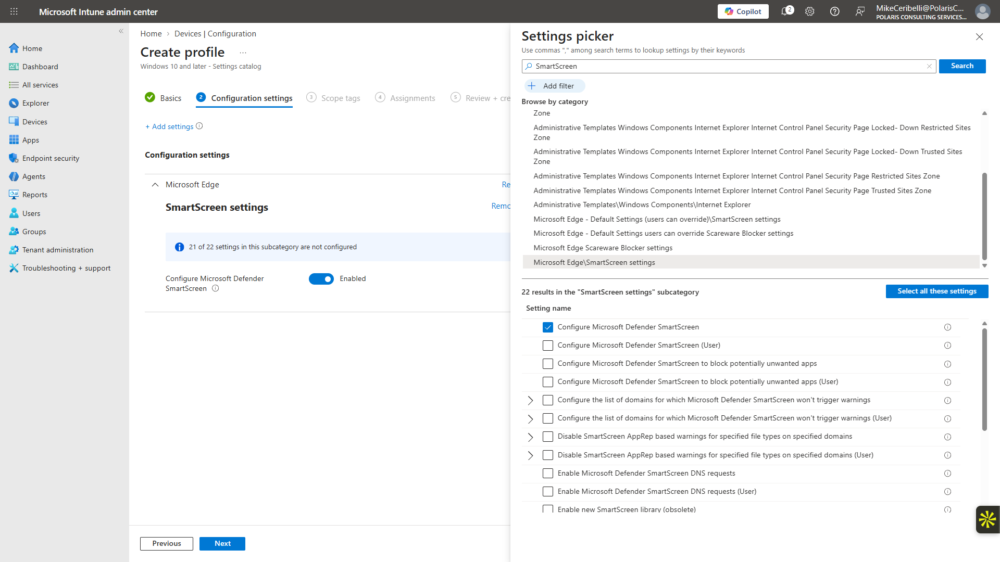

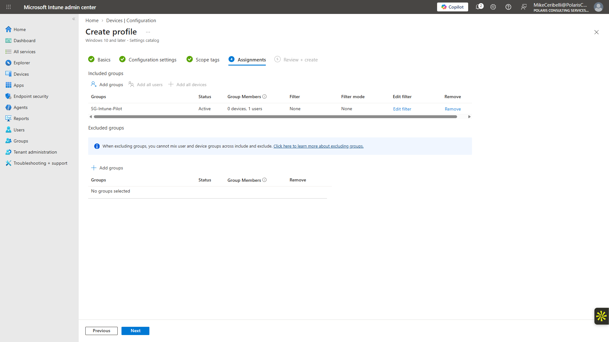

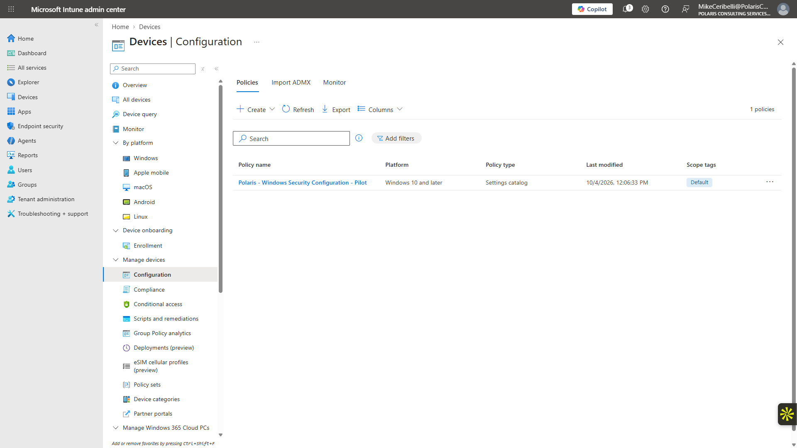

### Step 6 — Review Endpoint Security

Endpoint Security workloads and available security baselines were reviewed without deploying a broad hardening baseline.

<strong>Portal procedure</strong>

**Navigation:** Microsoft Intune admin center → Endpoint security

1. Open **Endpoint security**.
2. Review the available workloads: antivirus, disk encryption, firewall, endpoint detection and response, attack-surface reduction, account protection, and security baselines.
3. Review available security baseline families.
4. Do not deploy a broad baseline before a disposable test endpoint is available.

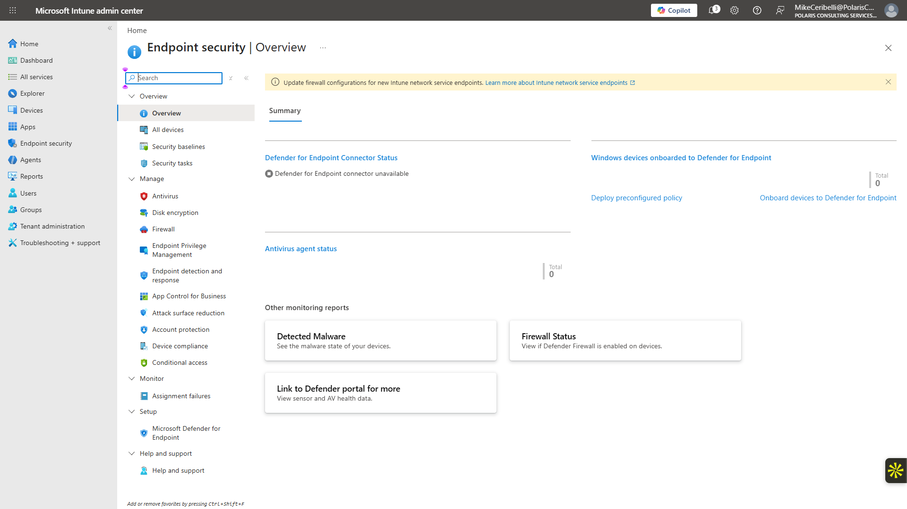

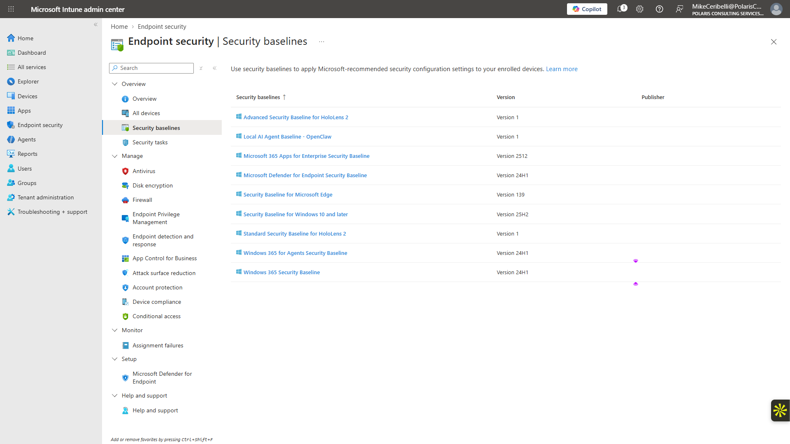

### Step 7 — Review Defender for Endpoint integration

At this stage the Defender for Endpoint connection showed unavailable, which was documented for later endpoint-security expansion.

<strong>Portal procedure</strong>

**Navigation:** Microsoft Intune admin center → Endpoint security → Microsoft Defender for Endpoint

1. Open **Endpoint security → Microsoft Defender for Endpoint**.
2. Review the connection/connector state.
3. Record the unavailable state present at this stage.
4. Leave connector changes for the later Defender for Endpoint onboarding project.

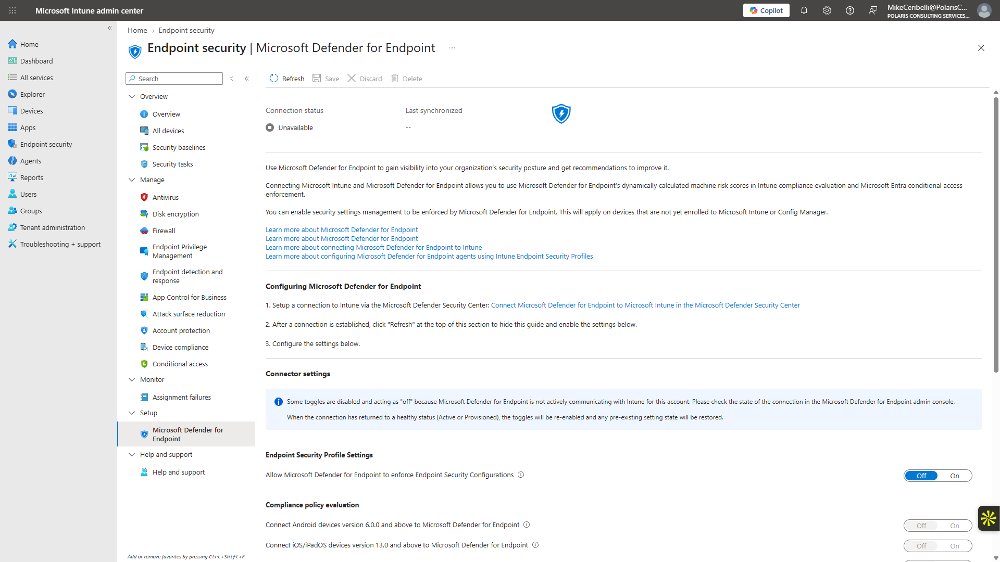

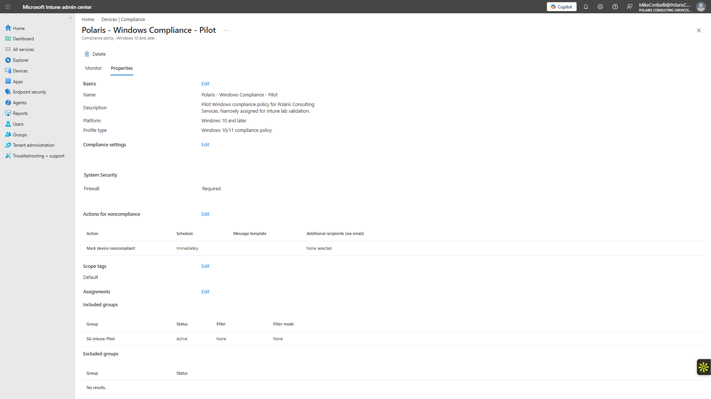

## Expected Outcome

The pilot policies exist and are assigned correctly while the tenant still has no managed endpoint, making the distinction between configuration and actual device evaluation explicit.

## Validation

- MDM authority and enrollment configuration reviewed.
- Initial managed-device count remained zero.
- Pilot group created.
- Compliance policy created and assigned.
- SmartScreen Settings Catalog profile created and assigned.
- No device compliance or configuration result claimed before device enrollment.

## Security Considerations

- The physical workstation was not enrolled for the sake of screenshots.
- No broad All Users / All Devices policy assignment was used.
- No paid Intune Suite or Remote Help add-on was introduced.
- Security baselines were reviewed but not deployed without an enrolled test endpoint.

## Key Takeaways

- Enrollment, assignment, delivery, evaluation, configuration, and compliance are separate endpoint-management stages.
- A policy can be correctly assigned even when no device has received or evaluated it.
- Pilot targeting reduces the impact of configuration mistakes during endpoint-management testing.
