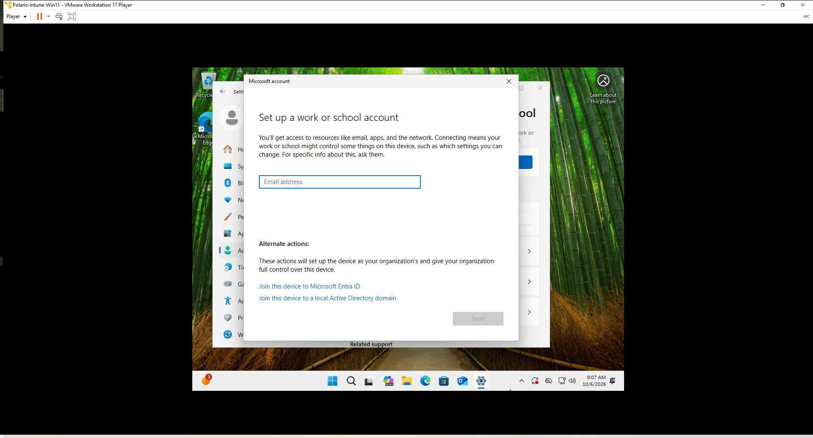
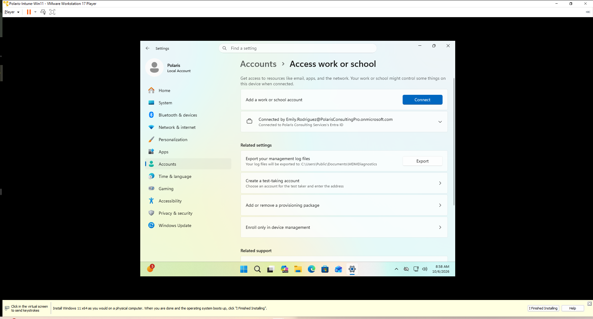
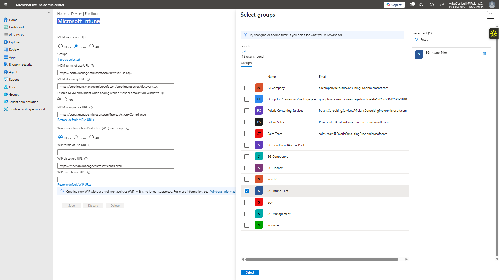
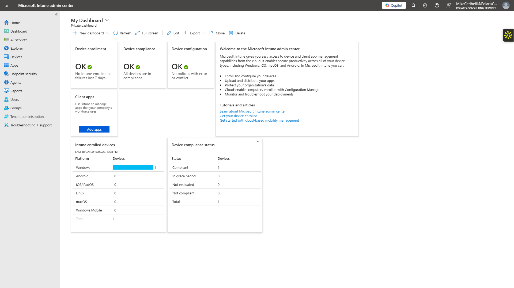
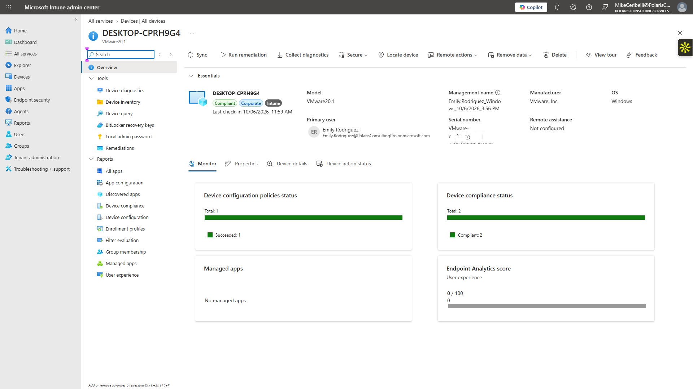
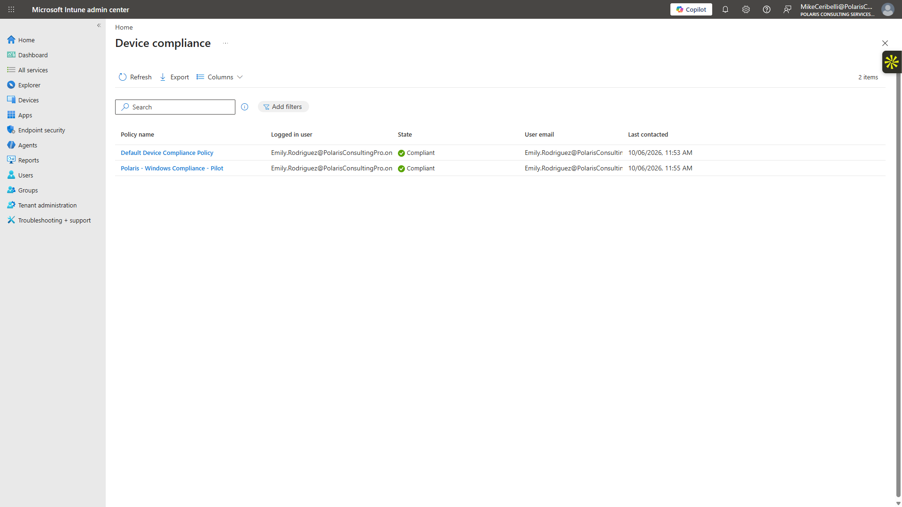
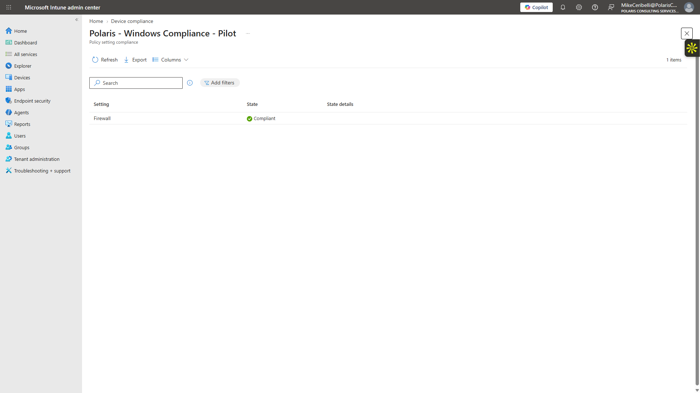
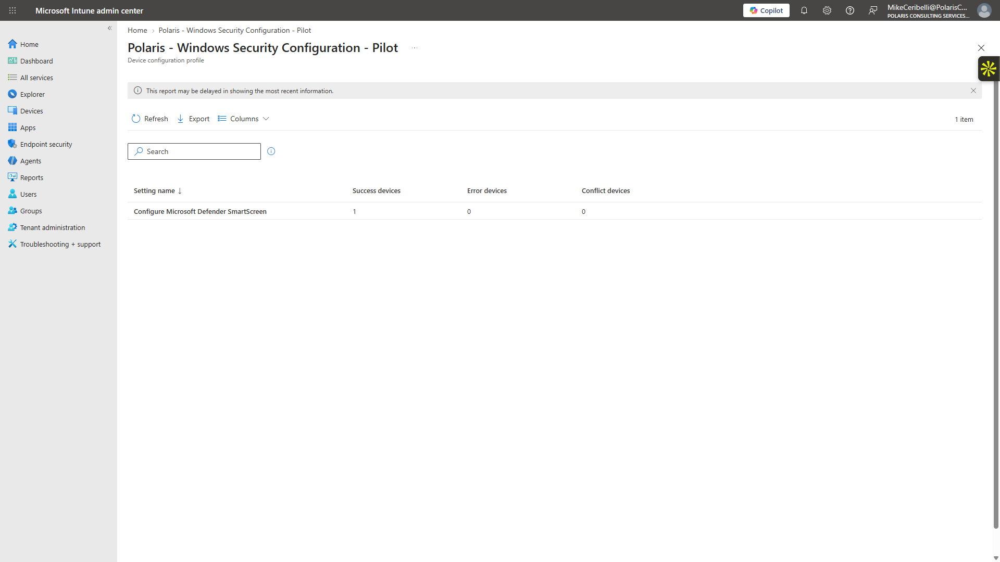

# Lab 11 — Intune Windows Endpoint Validation

**Status:** Complete

## Overview

Extends the Intune baseline with a disposable Windows 11 VMware endpoint and validates real policy delivery, configuration, and compliance.

## Scenario

The initial Intune lab proved configuration and assignment but had no device result. A dedicated Windows 11 VM was introduced so the full enrollment-to-evaluation lifecycle could be validated without managing the physical host.

## Objectives

- Connect a disposable Windows 11 VM to the Polaris organization.
- Enroll the VM into Intune through the pilot scope.
- Confirm the managed-device record and primary user.
- Validate firewall compliance.
- Validate SmartScreen configuration delivery.
- Troubleshoot device check-in without affecting the physical workstation.

## Tools and Services Used

- Windows 11 Pro
- VMware
- Microsoft Entra join
- Microsoft Intune
- Windows compliance
- Settings Catalog

## Administrative Workflow

The portal procedures below reflect the navigation used during this lab. Microsoft occasionally changes portal labels or menu placement, but the administrative sequence and validation points remain the same.

### Step 1 — Connect the Windows work account

The disposable Windows 11 VM was connected to the Polaris organization using the test user account.

<strong>Portal procedure</strong>

**Navigation:** Windows 11 Settings → Settings → Accounts → Access work or school → Connect

1. Start the disposable Windows 11 VMware VM.
2. Open **Settings → Accounts → Access work or school**.
3. Select **Connect**.
4. Use the Polaris organizational account assigned to the Intune pilot.
5. Complete the organizational sign-in.
6. Allow the device to join/connect to the organization.
7. Confirm the work or school account appears in Windows Settings.

### Step 2 — Confirm pilot enrollment scope

Automatic enrollment remained scoped to the Intune pilot rather than the entire organization.

<strong>Portal procedure</strong>

**Navigation:** Microsoft Intune admin center → Devices → Enrollment → Automatic enrollment

1. Open the Intune automatic-enrollment settings.
2. Confirm that MDM enrollment is scoped to the intended pilot rather than all users.
3. Verify that the test user remains a member of the Intune pilot group.
4. Do not broaden enrollment merely to accelerate the lab.

### Step 3 — Verify the enrolled-device inventory

After join and enrollment, the Intune dashboard reflected the managed endpoint.

<strong>Portal procedure</strong>

**Navigation:** Microsoft Intune admin center → Devices → All devices → DESKTOP-CPRH9G4

1. Open **Devices → All devices**.
2. Locate `DESKTOP-CPRH9G4`.
3. Open the device record.
4. Review management authority, ownership, operating system, primary user, and last check-in.
5. Confirm the endpoint is managed by Intune and shows the expected corporate state.

### Step 4 — Validate compliance

The Windows compliance policy evaluated the endpoint and the firewall requirement reported compliant.

<strong>Portal procedure</strong>

**Navigation:** Microsoft Intune admin center → Devices → Compliance / device record → Device compliance

1. Open the managed device record.
2. Open the device compliance view.
3. Locate `Polaris - Windows Compliance - Pilot`.
4. Review the overall result.
5. Open the per-setting details and confirm that the firewall requirement reports **Compliant**.

### Step 5 — Validate configuration delivery

The SmartScreen configuration returned a successful per-setting result with no error or conflict.

<strong>Portal procedure</strong>

**Navigation:** Microsoft Intune admin center → Devices → Configuration / profile → Device and user status / Per-setting status

1. Open `Polaris - Windows Security Configuration - Pilot`.
2. Review deployment monitoring.
3. Open **Per-setting status**.
4. Locate the Microsoft Defender SmartScreen setting.
5. Confirm **Success = 1**, with no error or conflict for the pilot endpoint.
6. If results are delayed, sync the device and verify Windows date/time before rechecking.

## Expected Outcome

The VM appears as a managed corporate Windows endpoint, reports compliant for the firewall requirement, and shows successful delivery of the SmartScreen profile.

## Validation

- Windows 11 VM joined the Polaris Entra tenant.
- Device enrolled into Intune.
- Device ownership reported Corporate.
- Primary user mapped to Emily Rodriguez.
- Firewall compliance reported Compliant.
- SmartScreen per-setting status reported Success.

## Security Considerations

- The physical host remained outside Entra join and Intune management.
- The disposable VM provided a safe target for policy validation.
- Serial/device identifiers in public screenshots were redacted where appropriate.

## Common Issues and Troubleshooting

Policy results did not appear immediately. The useful corrective actions were signing into the VM with the organizational account, correcting/synchronizing the VM date and time, and allowing a normal device check-in cycle. Compliance and configuration results appeared afterward.

## Key Takeaways

- Policy assignment becomes operationally meaningful only after a managed endpoint checks in and reports results.
- Endpoint time and identity context can affect enrollment and management behavior.
- A disposable endpoint is a practical way to validate management controls without placing a personal workstation under lab policy.
