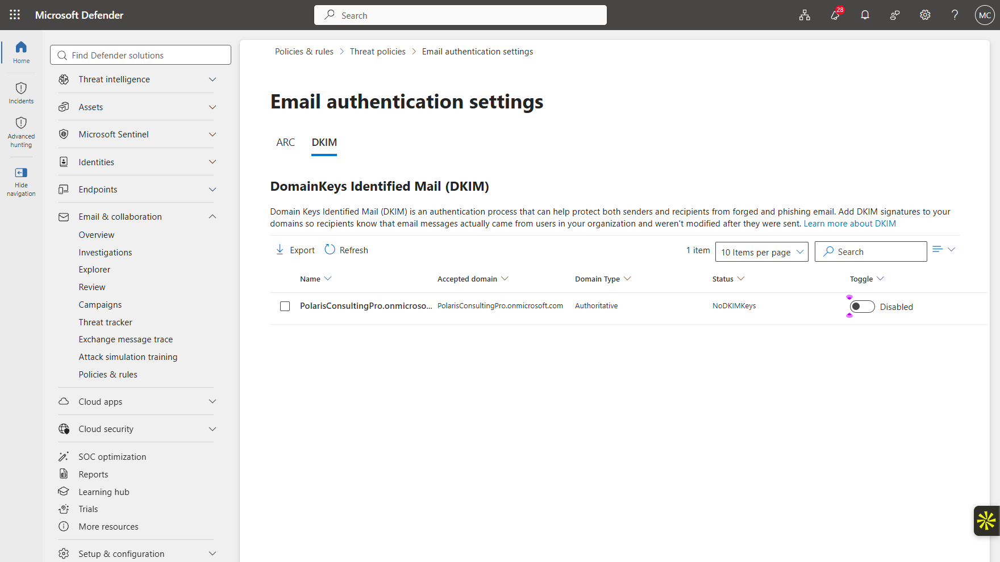
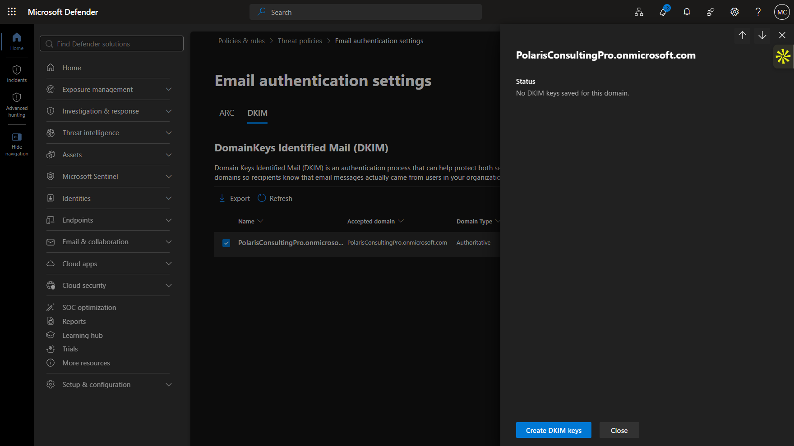
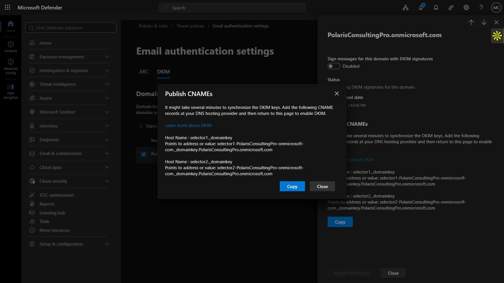
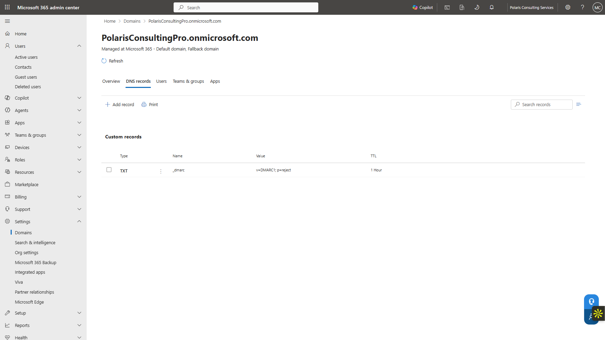
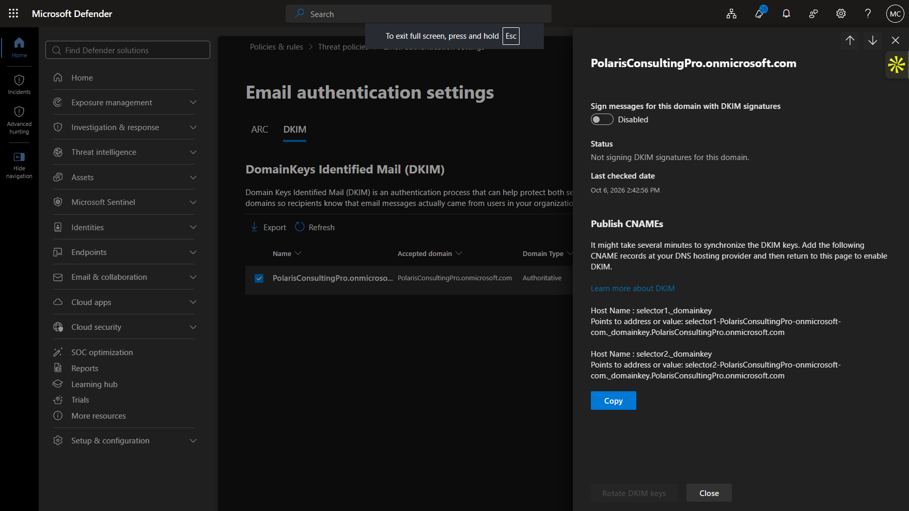
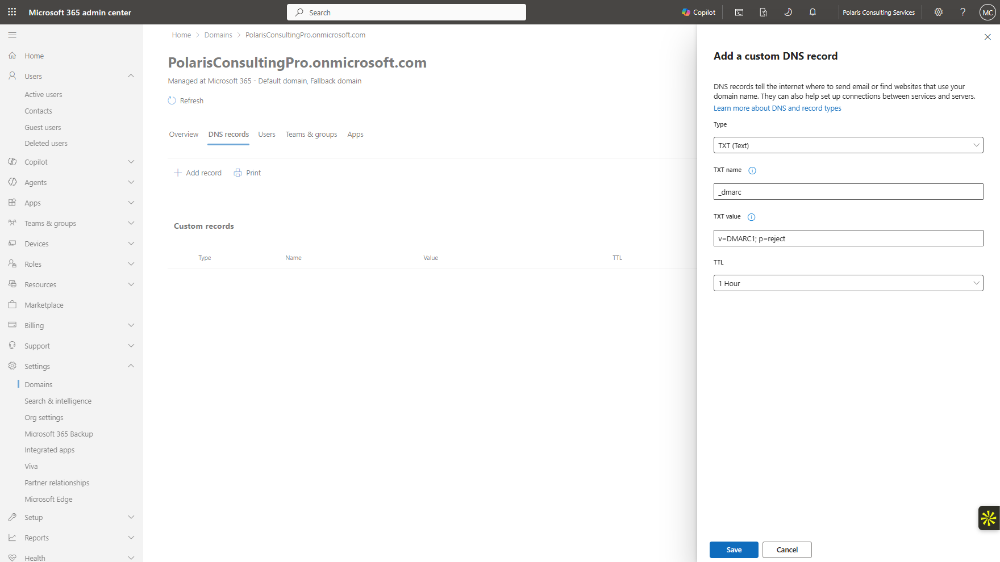
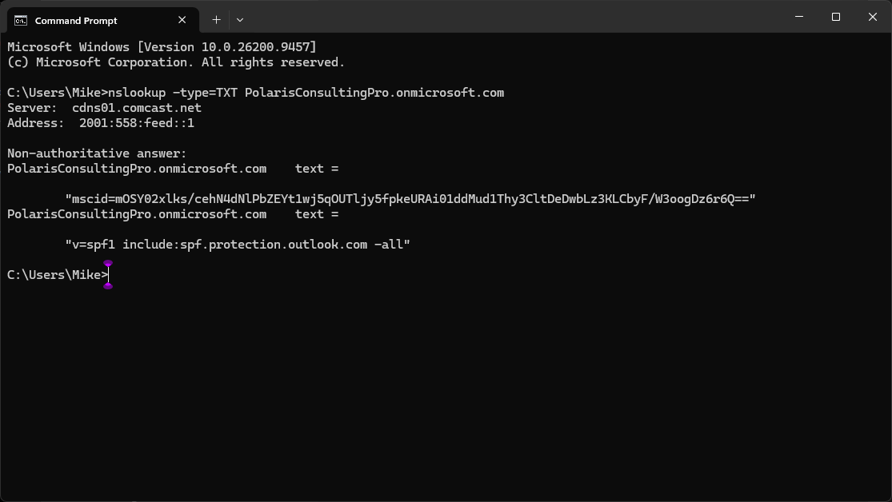
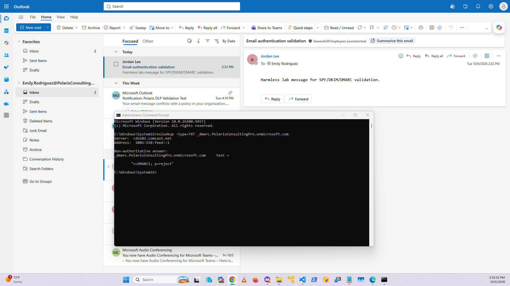

# Lab 13 — SPF, DKIM, and DMARC

**Status:** Complete

## Overview

Reviews and validates Microsoft 365 email-authentication controls for the Polaris tenant domain, including a documented DKIM limitation on the Microsoft-managed domain.

## Scenario

The Defender policy review identified DKIM as not started. A dedicated email-authentication lab was used to validate SPF, generate DKIM selectors, publish DMARC, and document what could and could not be completed with the Microsoft-managed `onmicrosoft.com` domain.

## Objectives

- Validate the existing SPF record.
- Generate DKIM keys/selectors.
- Review the required selector CNAME records.
- Document the DNS limitation preventing DKIM signing.
- Create and validate a DMARC TXT record.
- Inspect message-header evidence supporting the current authentication state.

## Tools and Services Used

- Microsoft Defender portal
- Microsoft 365 domain DNS management
- DNS / nslookup
- Exchange message headers

## Administrative Workflow

The portal procedures below reflect the navigation used during this lab. Microsoft occasionally changes portal labels or menu placement, but the administrative sequence and validation points remain the same.

### Step 1 — Review the initial DKIM state

The tenant domain initially showed DKIM disabled with no active signing state.

<strong>Portal procedure</strong>

**Navigation:** Microsoft Defender portal → Email & collaboration → Policies & rules → Threat policies → Email authentication settings → DKIM

1. Open the Defender email-authentication settings.
2. Select the Polaris tenant domain.
3. Review the DKIM state before key creation.
4. Record that signing is disabled and no active keys are available.

### Step 2 — Create the DKIM keys

The DKIM key-generation process was completed and Microsoft produced the selector information required for DNS publication.

<strong>Portal procedure</strong>

**Navigation:** Microsoft Defender portal → DKIM domain details → Create DKIM keys

1. Open the Polaris domain in the DKIM settings.
2. Select **Create DKIM keys**.
3. Allow Microsoft 365 to generate the selector configuration.
4. Review the selector information after key creation.

### Step 3 — Review the required CNAME selectors

Microsoft provided the `selector1` and `selector2` CNAME targets that would normally be published for DKIM signing.

<strong>Portal procedure</strong>

**Navigation:** Microsoft Defender portal → DKIM domain details → required DNS records

1. Open the DKIM domain details after key creation.
2. Record the two required host names: `selector1._domainkey` and `selector2._domainkey`.
3. Record the corresponding Microsoft 365 CNAME target values.
4. Keep DKIM signing off until the required DNS records can be published.

### Step 4 — Document the DNS boundary

The Microsoft-managed domain interface available in this lab exposed TXT management but not the required CNAME publication path. DKIM signing therefore remained off rather than using an unsupported workaround.

<strong>Portal procedure</strong>

**Navigation:** Microsoft 365 admin center → Settings → Domains → PolarisConsultingPro.onmicrosoft.com → DNS records

1. Open **Settings → Domains**.
2. Select `PolarisConsultingPro.onmicrosoft.com`.
3. Review the available DNS-record management options.
4. Confirm that the lab interface exposes TXT record management but not the required CNAME publication workflow.
5. Return to the DKIM settings and confirm the domain remains **Not signing DKIM signatures**.

### Step 5 — Create and validate DMARC

A DMARC TXT record with `p=reject` was created and public DNS queries were used to validate both DMARC and the existing SPF record.

<strong>Portal procedure</strong>

**Navigation:** Microsoft 365 admin center / Windows command line → Domain DNS records → Add TXT + nslookup

1. In the domain DNS-record interface, add a TXT record named `_dmarc`.
2. Set the value to `v=DMARC1; p=reject`.
3. Use the configured TTL.
4. Save the record.
5. From a command prompt or PowerShell session, query the DMARC TXT record with `nslookup`.
6. Query the domain SPF TXT record as well.
7. Confirm the public responses match the configured values.

### Step 6 — Review message-header evidence

Internal message headers were inspected as supporting evidence for the current non-signing DKIM state.

<strong>Portal procedure</strong>

**Navigation:** Outlook / message source → Open message → View message details / headers

1. Open a representative internal message.
2. View the message source or authentication headers.
3. Locate the SPF/DKIM/DMARC authentication-result fields.
4. Record the `dkim=none` / non-signing state as supporting evidence only.
5. Use public DNS results as the authoritative validation for SPF and DMARC.

## Expected Outcome

SPF and DMARC are publicly validated, DKIM selectors are generated, and the inability to complete DKIM signing on the Microsoft-managed domain is clearly documented.

## Validation

- SPF record publicly resolved as `v=spf1 include:spf.protection.outlook.com -all`.
- DKIM selectors generated successfully.
- Required CNAME targets identified.
- DKIM signing remained off because required CNAME publication was unavailable in the lab DNS path.
- DMARC `v=DMARC1; p=reject` publicly validated.

## Security Considerations

- No unsupported DNS workaround was attempted.
- No custom domain purchase or third-party mail-security service was required.
- Public DNS validation was preferred over relying only on internal message behavior.

## Common Issues and Troubleshooting

The blocker was not DKIM key generation; it was DNS publication. Microsoft required two CNAME records before signing could be enabled, but the available Microsoft-managed domain DNS interface did not provide that CNAME workflow. The final state therefore documents generated selectors with signing still off.

## Key Takeaways

- SPF, DKIM, and DMARC depend on both Microsoft 365 configuration and DNS control.
- DKIM key generation alone does not enable signing; selector publication is a separate prerequisite.
- Administrative boundaries should be documented accurately rather than bypassed with unsupported workarounds.
