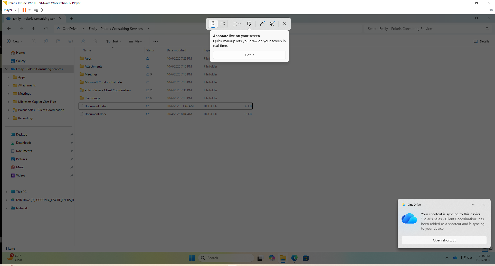
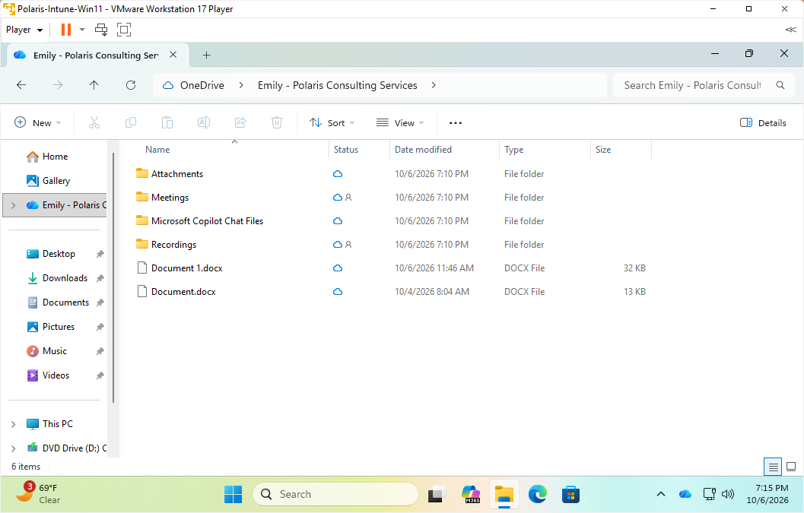
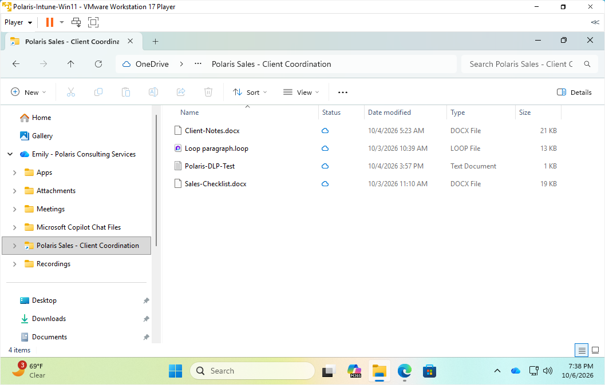
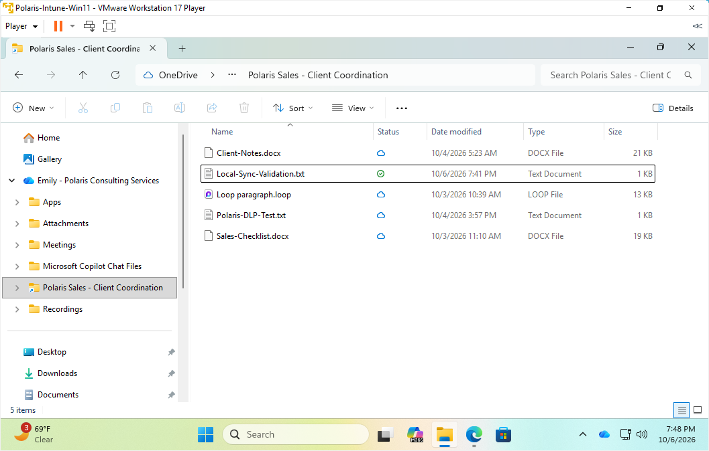
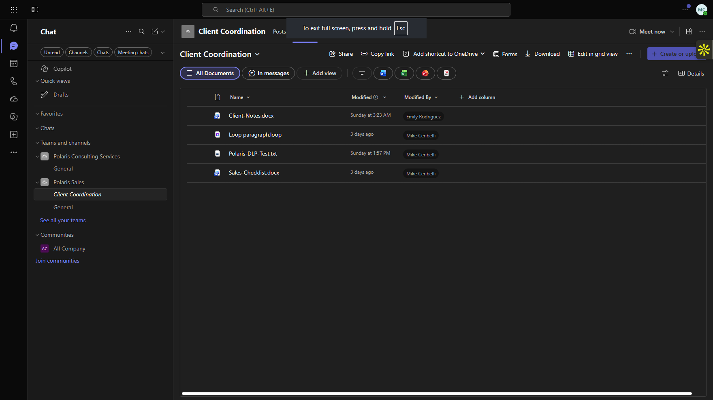
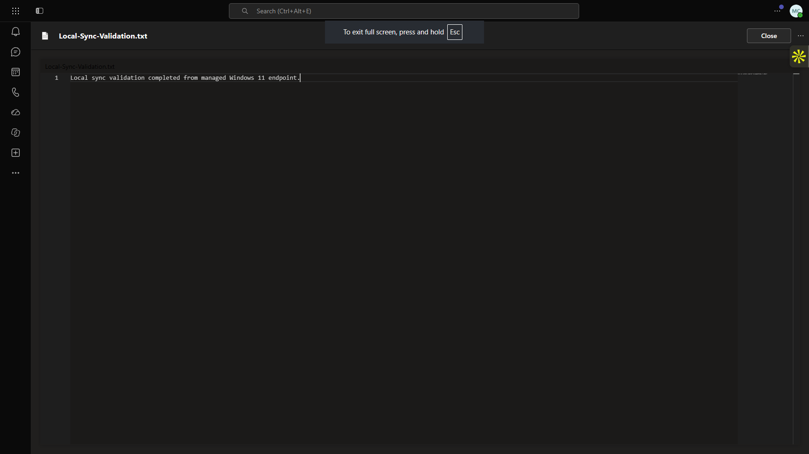

# Lab 14 — OneDrive and SharePoint Local Sync

**Status:** Complete

## Overview

Validates the end-to-end synchronization path between a Teams/SharePoint channel and the managed Windows endpoint through OneDrive.

## Scenario

The Sales channel content needed to be available locally on the managed Windows VM while still synchronizing back to Microsoft 365.

## Objectives

- Sign in to OneDrive with the organizational account.
- Add the Client Coordination SharePoint location to OneDrive.
- Confirm the content appears in File Explorer.
- Create a local validation file.
- Verify synchronization status.
- Confirm the same file and content in Teams/SharePoint.

## Tools and Services Used

- OneDrive for Business
- SharePoint Online
- Microsoft Teams
- Windows File Explorer

## Administrative Workflow

The portal procedures below reflect the navigation used during this lab. Microsoft occasionally changes portal labels or menu placement, but the administrative sequence and validation points remain the same.

### Step 1 — Add the SharePoint location to OneDrive

The Client Coordination location was added using `Add shortcut to OneDrive → My files`.

<strong>Portal procedure</strong>

**Navigation:** Microsoft Teams / SharePoint Online → Client Coordination files → Add shortcut to OneDrive → My files

1. Open the Polaris Sales `Client Coordination` file location.
2. Choose **Add shortcut to OneDrive**.
3. Select **My files** as the shortcut destination.
4. Wait for OneDrive to process the shortcut.
5. Confirm that the notification indicates the location was added.

### Step 2 — Verify the organizational OneDrive folder

The Polaris organizational OneDrive appeared in File Explorer on the managed VM.

<strong>Portal procedure</strong>

**Navigation:** Windows File Explorer → File Explorer → OneDrive - Polaris Consulting Services

1. On the managed VM, open File Explorer.
2. Expand **OneDrive - Polaris Consulting Services**.
3. Confirm that the organizational OneDrive root is present.
4. Allow OneDrive time to finish any initial synchronization.

### Step 3 — Confirm the Client Coordination content locally

The expected channel files were visible through the local OneDrive path.

<strong>Portal procedure</strong>

**Navigation:** Windows File Explorer → OneDrive - Polaris Consulting Services → Client Coordination

1. Open the synchronized `Client Coordination` location.
2. Confirm that the existing channel files are visible locally.
3. Review the OneDrive status icons to confirm synchronization state.

### Step 4 — Create the local validation file

`Local-Sync-Validation.txt` was created locally and allowed to synchronize.

<strong>Portal procedure</strong>

**Navigation:** Windows File Explorer / Notepad → Client Coordination folder → new text file

1. Create a new text file in the local `Client Coordination` folder.
2. Name it `Local-Sync-Validation.txt`.
3. Add a short validation line and save the file.
4. If Windows hides extensions, verify that the file is not accidentally named `.txt.txt`.
5. Wait until the OneDrive status indicates synchronization is complete.

### Step 5 — Validate the cloud copy

The same file and contents were verified from the cloud-side Teams/SharePoint location.

<strong>Portal procedure</strong>

**Navigation:** Microsoft Teams / SharePoint Online → Client Coordination files → open Local-Sync-Validation.txt

1. Return to the cloud-side `Client Coordination` file location.
2. Refresh the file list.
3. Confirm that `Local-Sync-Validation.txt` is present.
4. Open the file and compare the contents with the local version.
5. Use the matching file and content as end-to-end sync validation.

## Expected Outcome

The channel content is accessible locally, a locally created file synchronizes successfully, and the cloud-side copy matches.

## Validation

- Organizational OneDrive folder visible in File Explorer.
- Client Coordination files available locally.
- Local validation file reached synchronized status.
- Cloud-side Teams/SharePoint location showed the same file and contents.

## Security Considerations

- The physical host OneDrive configuration was not modified.
- All synchronization testing occurred inside the disposable managed VM.

## Common Issues and Troubleshooting

The VM did not have Microsoft Word installed, so the planned `.docx` edit was replaced with a simple text file. Hidden Windows file extensions briefly produced `Local-Sync-Validation.txt.txt`; the filename was corrected before the final sync validation.

## Key Takeaways

- Teams channel storage, SharePoint, OneDrive, and File Explorer form one connected collaboration path for standard channel files.
- Local sync validation should confirm both client status and the resulting cloud copy.
- A small test file can prove the synchronization workflow without expanding the endpoint software footprint.
