# Lab 15 — Power BI Service Desk Analytics

**Status:** Complete

## Overview

Transforms a fictional IT service desk dataset into an interactive operations report and publishes it to Power BI Service.

## Scenario

A support organization needed a concise operational view of ticket volume, backlog, resolution time, technician workload, and SLA performance.

## Objectives

- Import and validate the service desk dataset.
- Create core support KPIs with DAX.
- Build category, status, trend, workload, and SLA visuals.
- Add slicers and validate cross-filtering.
- Publish the report to Power BI Service.
- Create a dashboard with the most useful operational tiles.

## Tools and Services Used

- Power BI Desktop
- Power Query
- DAX
- Power BI Service

## Administrative Workflow

The portal procedures below reflect the navigation used during this lab. Microsoft occasionally changes portal labels or menu placement, but the administrative sequence and validation points remain the same.

### Step 1 — Import the ticket dataset

The CSV contained 84 fictional support tickets with dates, status, priority, category, department, technician, resolution time, SLA status, and channel.

<strong>Portal procedure</strong>

**Navigation:** Power BI Desktop → Home → Get data → Text/CSV

1. Open Power BI Desktop.
2. Select **Get data → Text/CSV**.
3. Choose `Polaris-IT-ServiceDesk-Tickets.csv`.
4. Preview the columns and data types.
5. Load the dataset or open Power Query when type adjustments are required.
6. Confirm the expected 84 ticket rows are available.

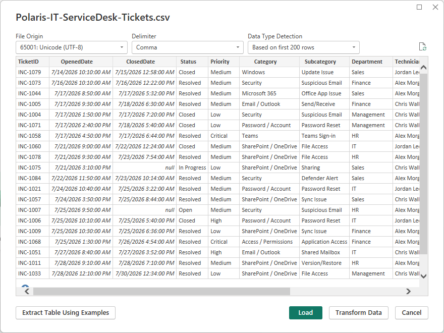

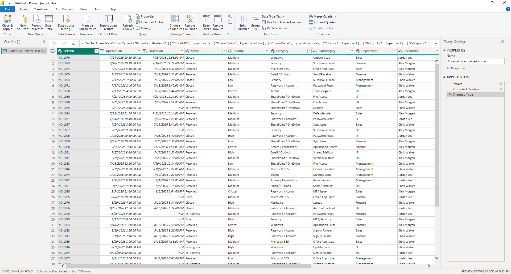

### Step 2 — Build the KPI layer

Measures were created for total tickets, open tickets, resolved tickets, average resolution hours, and SLA compliance.

<strong>Portal procedure</strong>

**Navigation:** Power BI Desktop → Modeling → New measure

1. Open the **Modeling** ribbon.
2. Create measures for total tickets, open tickets, resolved tickets, average resolution hours, and SLA compliance.
3. Use the ticket table as the measure source.
4. Format percentage and decimal measures appropriately.
5. Add each measure to a card visual and verify the expected values.

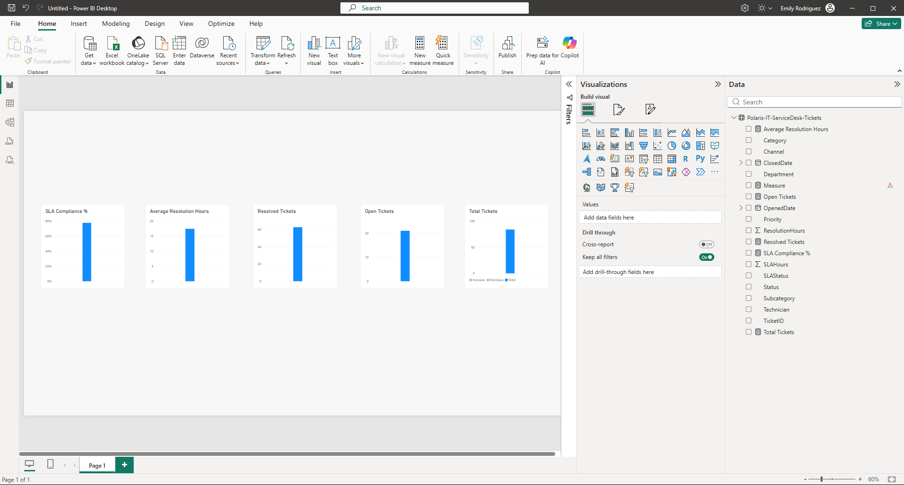

### Step 3 — Build the operational visuals

The report added status/category views, ticket trend, technician workload, a detailed table, and interactive slicers.

<strong>Portal procedure</strong>

**Navigation:** Power BI Desktop → Report view → Visualizations

1. In Report view, add a category visual using ticket category and ticket count.
2. Add a status visual.
3. Add a date-based ticket trend.
4. Add a technician workload visual.
5. Add an SLA-status visual.
6. Add a detailed ticket table.
7. Add slicers for Department, Technician, Priority, and Status.
8. Arrange and resize the visuals into a readable operations overview.

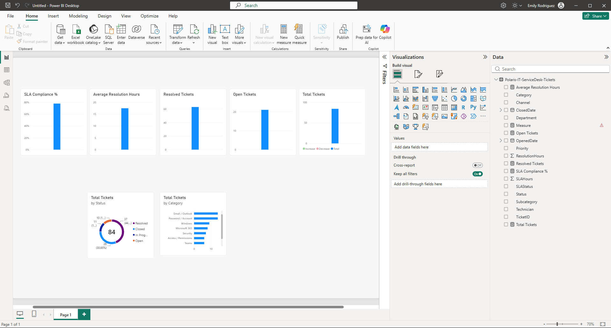

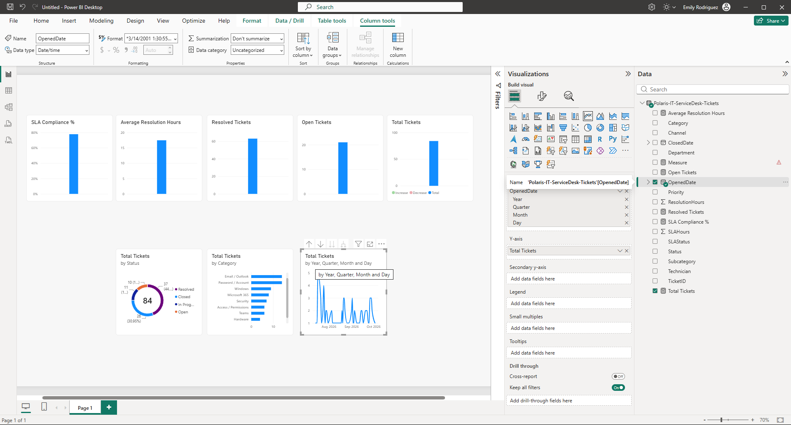

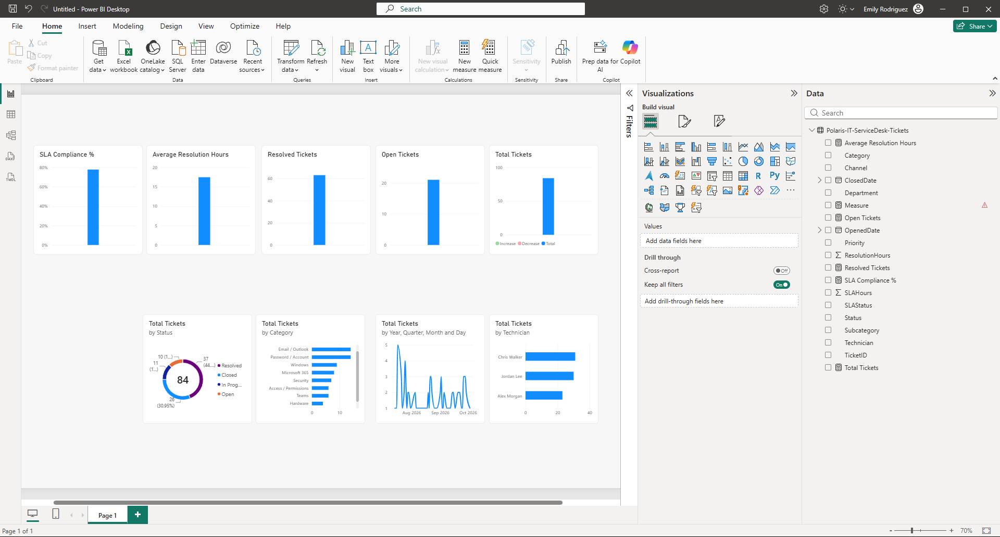

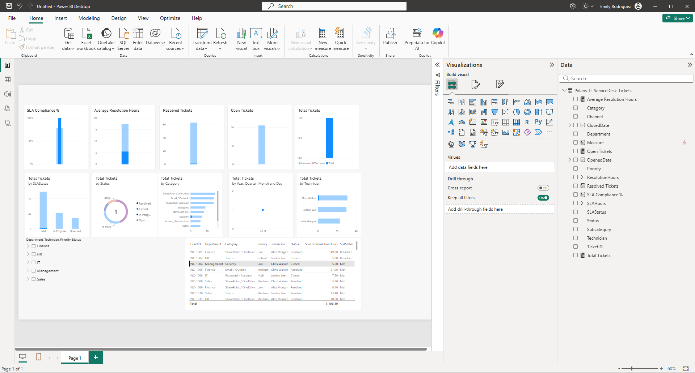

### Step 4 — Validate interactivity

Department and other slicers were tested to confirm that KPIs, charts, and the detail table responded correctly.

<strong>Portal procedure</strong>

**Navigation:** Power BI Desktop → Report view → slicers / visual interactions

1. Select a department such as Sales from the slicer.
2. Confirm that KPI cards update.
3. Confirm that charts and the detail table respond to the filter.
4. Select a category or chart element and verify cross-filtering/highlighting.
5. Clear the selection and confirm the report returns to the full dataset.

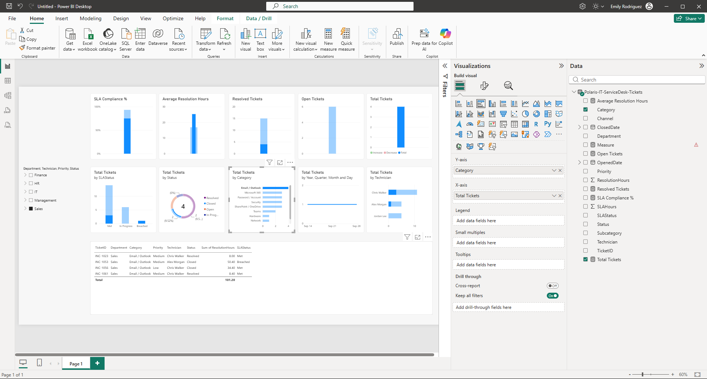

### Step 5 — Review the final Desktop report

The final report page combined the main operational KPIs and analysis visuals into one dashboard-style layout.

<strong>Portal procedure</strong>

**Navigation:** Power BI Desktop → Report view

1. Review the complete report at normal viewing scale.
2. Confirm that titles, cards, charts, slicers, and the detail table are readable.
3. Check that no visual overlaps or hides important values.
4. Save the `.pbix` file with the dataset in the project folder.

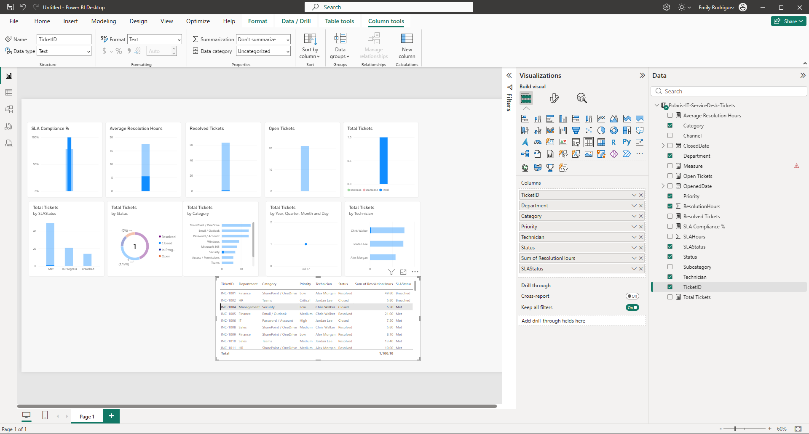

### Step 6 — Publish to Power BI Service

The report was published to the user's workspace and opened successfully in the cloud.

<strong>Portal procedure</strong>

**Navigation:** Power BI Desktop / Power BI Service → Home → Publish → My workspace

1. In Power BI Desktop, select **Publish**.
2. Choose the intended Power BI workspace.
3. Wait for the publish operation to complete.
4. Open Power BI Service.
5. Open **My workspace**.
6. Open the published report and confirm slicers, cards, charts, and table interactions work in the browser.

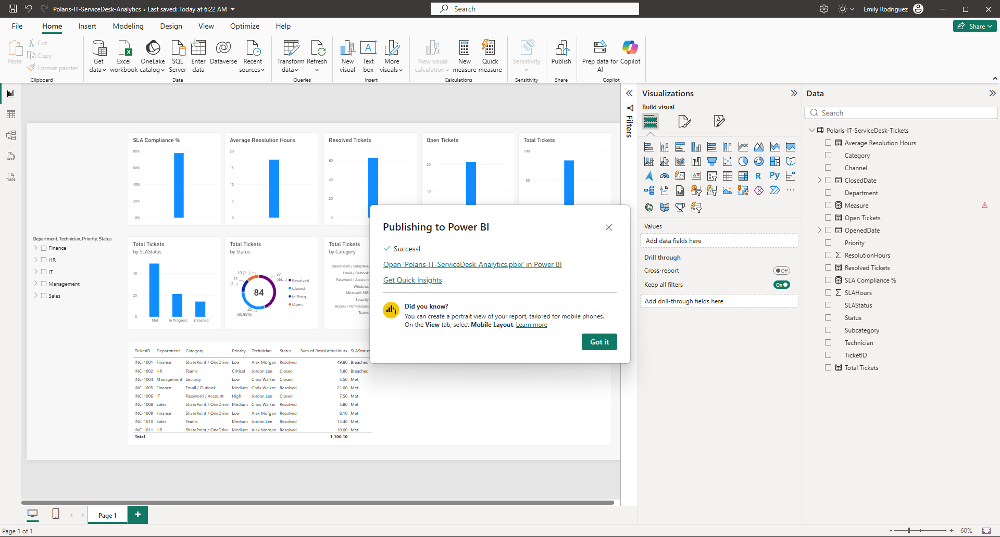

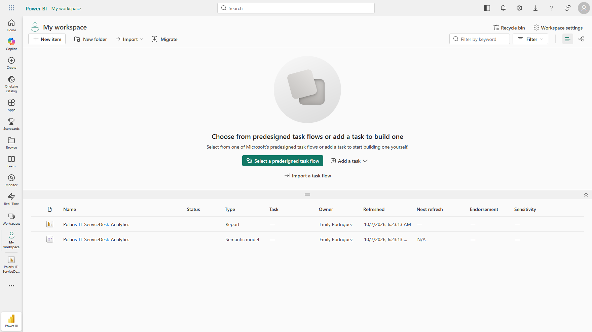

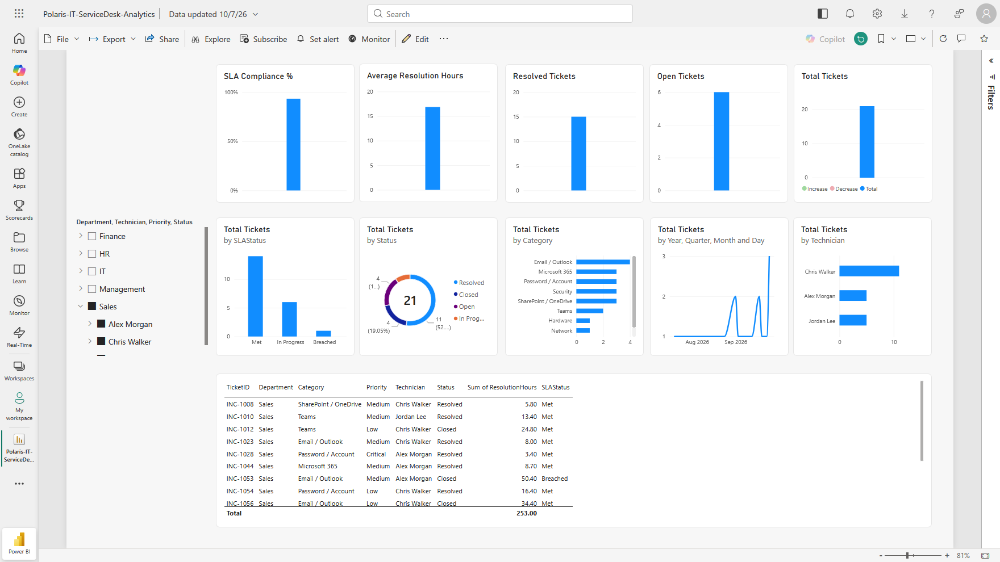

### Step 7 — Create the service dashboard

Five high-value visuals were pinned to the `Polaris IT Service Desk Dashboard`.

<strong>Portal procedure</strong>

**Navigation:** Power BI Service → Open report → Pin visual → New/existing dashboard

1. Open the published report in Power BI Service.
2. Hover over the Total Tickets card and select the pin icon.
3. Pin it to `Polaris IT Service Desk Dashboard`.
4. Repeat for Open Tickets, SLA Compliance, Tickets by Category, and Ticket Trend.
5. Open the dashboard and confirm all five tiles are visible.

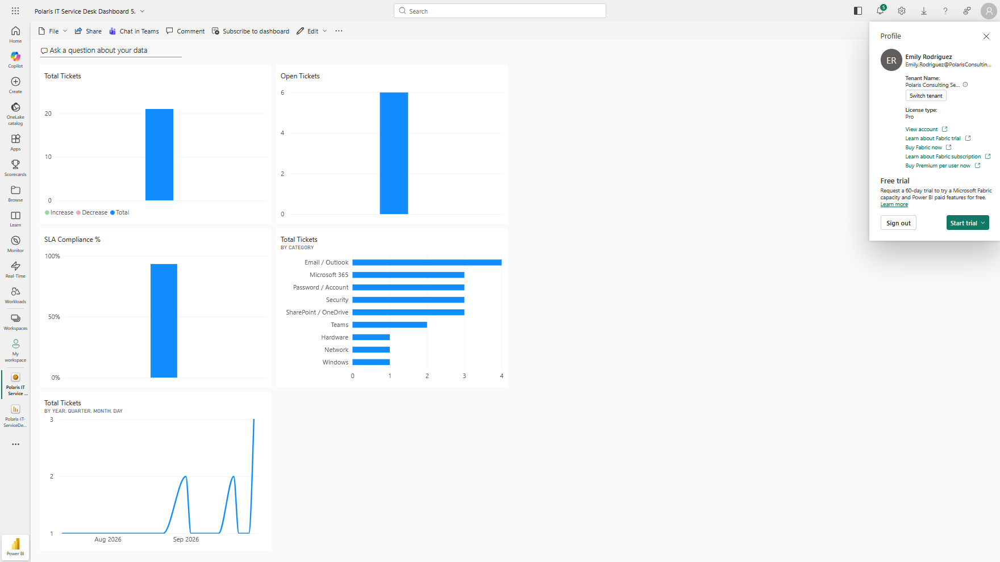

## Expected Outcome

The report provides an interactive service desk overview in Power BI Desktop and Power BI Service, with a concise dashboard for headline metrics.

## Validation

- 84-ticket dataset imported and reviewed.
- Total Tickets = 84; Open Tickets = 21; Resolved Tickets = 63.
- Average Resolution Hours = 17.46.
- SLA Compliance = 77.8%.
- Slicers and cross-filtering changed multiple visuals as expected.
- Cloud report and five-tile dashboard published successfully.

## Security Considerations

- The dataset contains only lab-generated support records.
- No Fabric, Premium, or paid BI trial was introduced for the project.
- The host remained outside the Entra/Intune lab management scope.

## Common Issues and Troubleshooting

A DAX expression error was corrected after an accidental `Measure 2 =` prefix was introduced. The report layout was also reorganized after the first version became crowded, and a cloud permission prompt was resolved by opening the published report from the intended workspace.

## Key Takeaways

- Operational reporting is most useful when headline KPIs, trend views, workload analysis, and drillable detail are available together.
- Interactive filtering provides more value than a static screenshot because the same report can answer multiple service-management questions.
- Publishing to Power BI Service validates the full path from local report development to cloud consumption.
