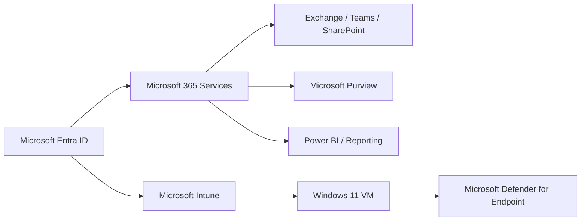

# Microsoft 365 Administration Portfolio

Tenant administration across identity, messaging, collaboration, compliance, endpoint management, email authentication, and reporting.

## Portfolio Overview

This repository documents the Microsoft 365 environment for **Polaris Consulting Services** through a series of operational administration and support projects. The emphasis is on configuration that can be validated through user behavior, service telemetry, policy results, message trace, sign-in logs, endpoint reporting, and other native Microsoft 365 evidence.

The tenant users, service-desk records, payment-card test values, and business scenarios were created specifically for the lab environment.

## Environment at a Glance

- Microsoft 365 E5 / Office 365 E5 lab tenant
- Microsoft Entra ID
- Exchange Online
- Microsoft Teams
- SharePoint Online
- Microsoft Intune
- Microsoft Defender
- Microsoft Purview
- OneDrive for Business
- Power BI
- Windows 11 Pro VMware endpoint

## Projects

| Lab | Project | Primary focus |
|---|---|---|
| 01 | [Tenant Foundation](Lab-01-Tenant-Foundation/README.md) | Identity, licensing, groups |
| 04 | [Exchange Online Administration](Lab-04-Exchange-Online-Administration/README.md) | Mailboxes, delegation, aliases, trace |
| 05 | [Microsoft Teams Administration](Lab-05-Microsoft-Teams-Administration/README.md) | Teams ownership, channels, access |
| 06 | [SharePoint and Teams Integration](Lab-06-SharePoint-and-Teams-Integration/README.md) | SharePoint permissions, Teams files |
| 08 | [Microsoft Purview DLP and Sensitivity Labels](Lab-08-Microsoft-Purview-DLP-and-Sensitivity-Labels/README.md) | DLP, sensitivity labels |
| 09 | [Conditional Access and Privileged Identity Management](Lab-09-Conditional-Access-and-Privileged-Identity-Management/README.md) | Conditional Access, PIM |
| 10 | [Intune Endpoint Management Baseline](Lab-10-Intune-Endpoint-Management-Baseline/README.md) | Intune policy baseline |
| 11 | [Intune Windows Endpoint Validation](Lab-11-Intune-Windows-Endpoint-Validation/README.md) | Windows enrollment, compliance |
| 13 | [SPF, DKIM, and DMARC](Lab-13-SPF-DKIM-and-DMARC/README.md) | SPF, DKIM, DMARC |
| 14 | [OneDrive and SharePoint Local Sync](Lab-14-OneDrive-and-SharePoint-Local-Sync/README.md) | OneDrive / SharePoint sync |
| 15 | [Power BI Service Desk Analytics](Lab-15-Power-BI-Service-Desk-Analytics/README.md) | Power BI service-desk analytics |

## Core Competencies

- Microsoft Entra ID and group administration
- Exchange Online administration
- Teams and SharePoint administration
- Microsoft Purview DLP and sensitivity labels
- Conditional Access and PIM review
- Microsoft Intune compliance and configuration
- SPF, DKIM, and DMARC administration
- OneDrive synchronization
- Power BI publication and dashboarding

## Administrative Approach

The projects are documented as progressive operational workflows rather than isolated configuration screenshots. Each lab records the scenario, objectives, tools, administrative steps, validation evidence, relevant security considerations, troubleshooting, and final operational takeaways.

Where a Microsoft service remained in report-only, simulation, propagation, or asynchronous processing state, the documented result reflects the actual state of the environment.

## Environment Flow



## Repository Structure

```text
Microsoft-365-Admin-Portfolio/
├── README.md
├── Lab-01-Tenant-Foundation/
│   ├── README.md
│   └── screenshots/
├── Lab-04-Exchange-Online-Administration/
│   ├── README.md
│   └── screenshots/
├── Lab-05-Microsoft-Teams-Administration/
│   ├── README.md
│   └── screenshots/
├── Lab-06-SharePoint-and-Teams-Integration/
│   ├── README.md
│   └── screenshots/
├── Lab-08-Microsoft-Purview-DLP-and-Sensitivity-Labels/
│   ├── README.md
│   └── screenshots/
├── Lab-09-Conditional-Access-and-Privileged-Identity-Management/
│   ├── README.md
│   └── screenshots/
├── Lab-10-Intune-Endpoint-Management-Baseline/
│   ├── README.md
│   └── screenshots/
├── Lab-11-Intune-Windows-Endpoint-Validation/
│   ├── README.md
│   └── screenshots/
├── Lab-13-SPF-DKIM-and-DMARC/
│   ├── README.md
│   └── screenshots/
├── Lab-14-OneDrive-and-SharePoint-Local-Sync/
│   ├── README.md
│   └── screenshots/
├── Lab-15-Power-BI-Service-Desk-Analytics/
│   ├── README.md
│   └── screenshots/
```

## Evidence

Screenshots are placed beside the workflow step they support. Public copies were selected from the lab evidence pool, with sensitive identifiers removed or excluded where necessary.
